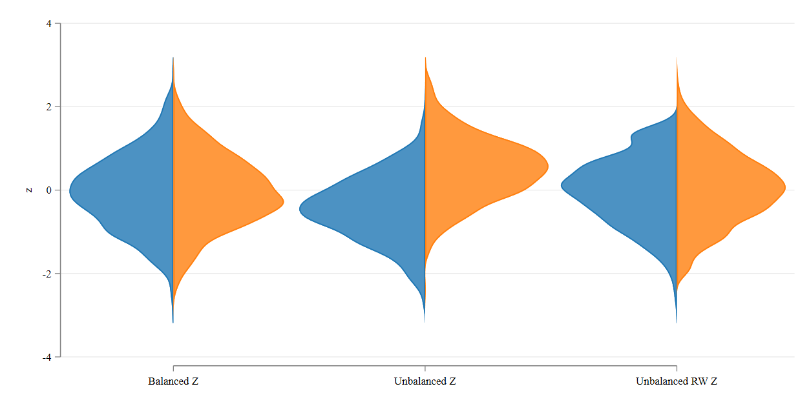
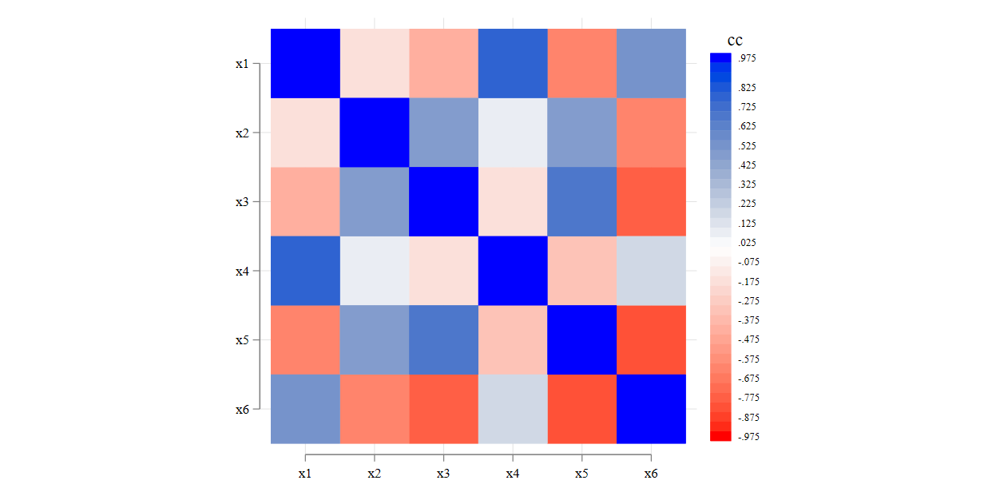
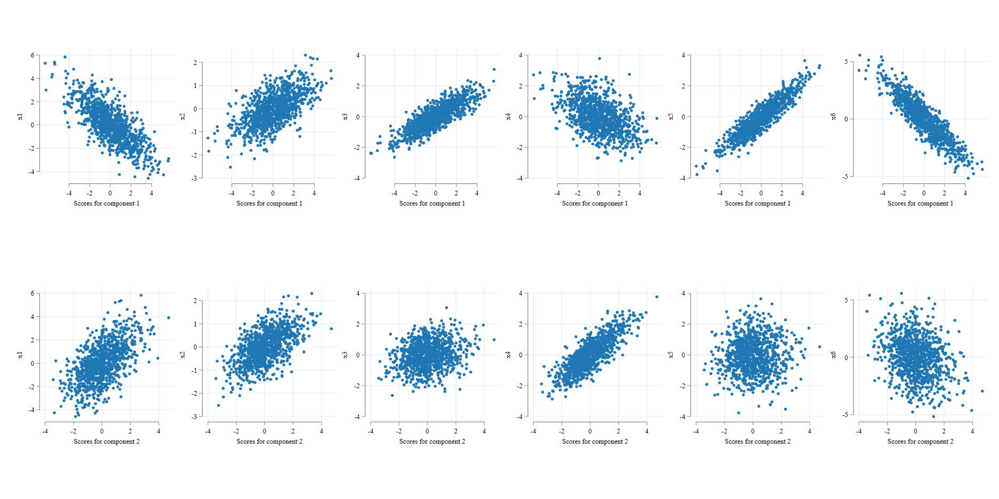
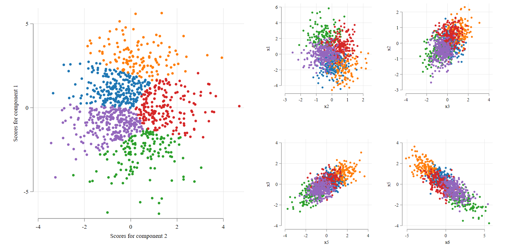
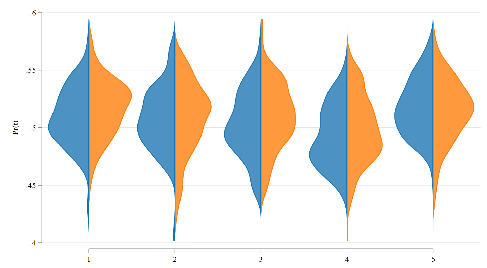
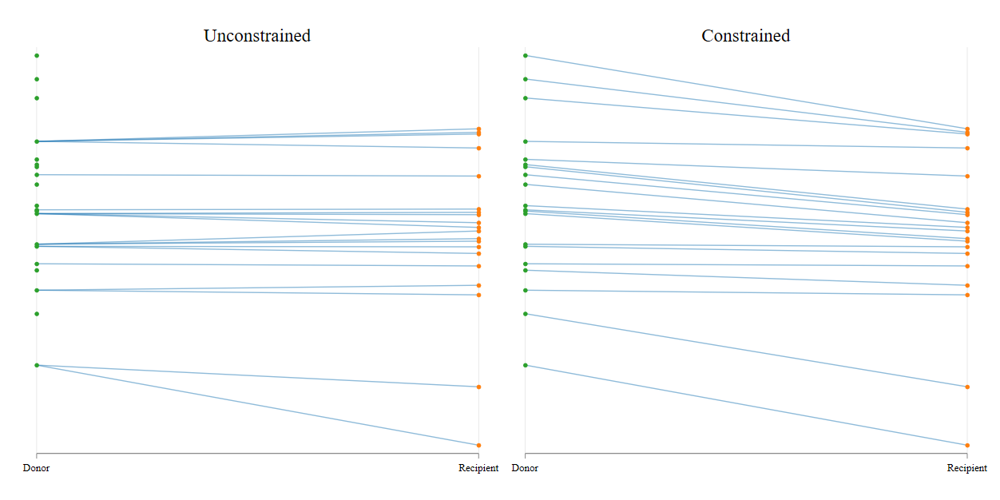
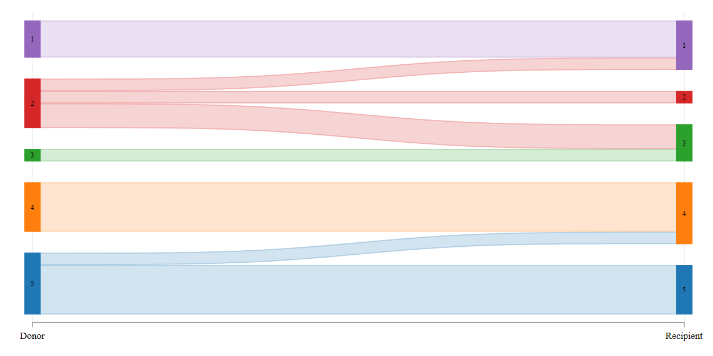

class: center middle
# Putting data together

--

## Even if they were created appart
```{r setup, include=FALSE}
options(htmltools.dir.version = FALSE)
```

???
background-image: url(https://madeinshoreditch.co.uk/wp-content/uploads/2016/01/long-distance-relationship-korean-couple-photo-collage-half-shiniart-e.jpg)
url(https://upload.wikimedia.org/wikipedia/commons/b/be/Sharingan_triple.svg)
---

## What is Statistical Matching

- Statistical matching is a methodology that can be used to **link** datasets together.

--

- The goal is to create a **synthetic** dataset that has variables that would otherwise not be observed simultaneously. (time use and Patriarcal perceptions)

--

- This type of analysis can be viewed as an imputation methodology when data is missing by design. 

--

  1. Each survey represents the population
  2. Each survey contains variables that the other doesn't.
  3. They both share a set of common variables that could be used to **link** them together.

--

- And once the data is put together, it could be used to draw some conclusions on otherwise unobserved relationships.

---

## Why not Linking 

- When referring to Matching and linking, it is common to relate SM to linking datasets with deterministic or stochastic identifiers.

--

- Deterministic identifiers, for example, use universal identifying variables (ID card numbers, Social Security, other) to link records across different databases.

--

- Stochastic identifiers work similarly to SM in that records are linked if they share very similar characteristics (age, sex, place residence, name, etc). Neverteless the potentially linked variables should refer to the **same** individuals across time. 

--

- When datasets belong collect to different individuals, the approaches above do not work, and we require a different method: Imputation.

- Specifically, we propose the application of Statistical Matching to link observations with similar characteristics from the population.

---

## Statistical Matching: Generalities

- Assume that you are interested in analyzing the joint distribution of three variables $F(x,y,z)$. 

- Unfortunately, variables are not collected in the same dataset. Instead, one has access to two datasets: $D$ and $R$.

  - Dataset $D$ has data for $(x,z)$, whereas $R$ has data for $(y,z)$

--

- If both samples collect information from the same underlying population, it would be possible to analyze the joint distribution, via the following simplification:

$$f(x,y,z)=f(x,y|z)f(z) \rightarrow f(x|z)f(y|z)f(z)$$
--

This has strong implications. 

--

- For Statistical matching to work (and most other Imputations), we need to impose the conditional independence assumption. $f(x,y|z)=f(x|z)f(y|z)$

--

- In other words, we need that conditional on $z$, $x$ and $y$ are as good as independent. Thus, all interdependence between them is captured via $z$.

---

## Statistical Matching: Implementation

- Under CIA, Statistical matching is as simple as substituting the population conditional distributions with the sample based distributions:

$$\hat f_R(x,y|z) \hat f_R(z)= \hat  f_R(x|z) \hat f_D(y|z) \hat f_R(z)$$
--

- Empirically we require to **transfer/copy** records from the *Donor* to the *Recipient* if they have sufficiently close Characteristics.

--

- However, three aspects should be considered before implementation:

---

## SM: Samples should representing the same population

- This is a testable assumption. 
- If both samples represent the same population, we can simply use the samples as is, before linking records across surveys. 
  $$f(x,y,z) = f_R(x,y,z) = f_D(x,y,z)$$
  
  - This can be tested by comparing the distributions of Z

--

- However, if the distributions of Z differ, one may need to do further adjustments before applying SM (re-weighting):

---

## SM: Samples should representing the same population




---

## SM: Accounting for High Dimensional Z

- When $Z$ is low dimensional, it is easy to "best" candidates for matching.

- However with high dimensional $z$, finding "best" matching candidates may be difficult, if not impossible. 
  - Finding another **you** in the population may not be feasible.
  
--

- The alternative is to "reduce" data dimensionality before proceed into the matching. We consider a 3 Step procedure:

  1. Principal Component Analysis: Data reduction technique that identifies few components that maximizes correlation with variables of Interest: $Z^K \rightarrow PCA  \rightarrow z^k$
  
  1. Cluster analysis: Uses $z^k$ to identify observations that are ***similar*** to each other.
  
  1. Propensity Score Estimation. Find $P(D|z)$ using a logit/LPM, etc. $Z^K \rightarrow logit  \rightarrow z^1$

---

## SM: Accounting for High Dimensional Z: PCA



---

## SM: Accounting for High Dimensional Z: PCA


---
## SM: Cluster Analysis


---

## SM: pscore and cluster Analysis



---

## SM: Matching Approach: Constrained vs Unconstrained

- The last consideration depends on what is the best approach for matching: Constrained vs unconstrained

--

- Unconstrained: Finding the "Best" match for each observation (closest in characteristics). 
  - Some units used multiple times, some none.
  - May not replicate the distribution of the "transferred" variable.
  
- Constrained: Finding the "Best" ranked match for each observation, but not the best for the observation.
  - All units are used once (weight wise)
  - It potentially replicates the full distribution of the "transferred" variable.
  - Raised the question of how to treat weighted Samples (best split sa)
  
---

## SM: Matching Approach: Constrained vs Unconstrained


---

## SM: Matching Approach: Constrained with Weight Split




---

## SM: Matching TUS to DHS (and HBS)

- For the African countries Case, we have a slightly more difficult scenario:

  - TUS is for most cases our Recipient data (Interest in intra-household interactions). 
    
  - Donor DHS. Complex survey that collects info for families, women, men, children. 
  
--
  
    - But not necessarily in the same household.
    
--  
  
- Solution: Double Match. DHS-Women -> TUS women; DHS-Men -> TUS Men

  - Balance characteristics only among eligible individuals (15-49 women 15-59 Men). 
  
  - Thus assumes CIA of "answers" regarding DHS intra household information.
  
--

- Data is also back linked to HBS (household Budget Survey) to obtain data on Consumption/Income and Construct LIMPTIP.

  - HBS -> TUS : Difficult to obtain household Data based on individual information
  - TUS -> HBS : Requires assuming CIA on time allocation 

---

class: center, middle

# Thank you

```{r xaringanExtra-scribble, echo=FALSE}
xaringanExtra::use_scribble()
```