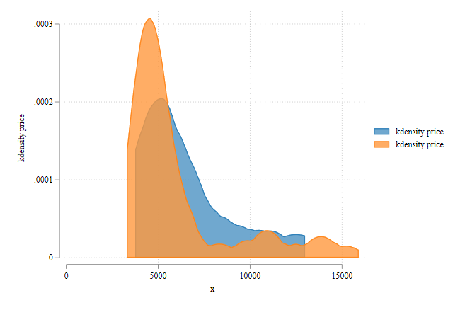
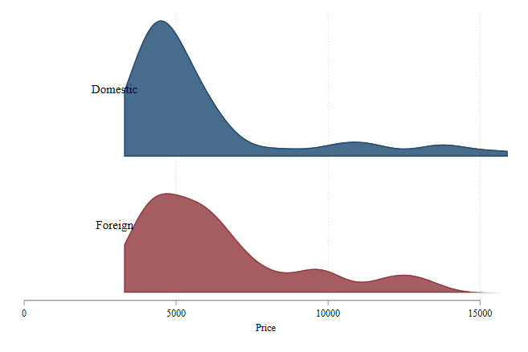
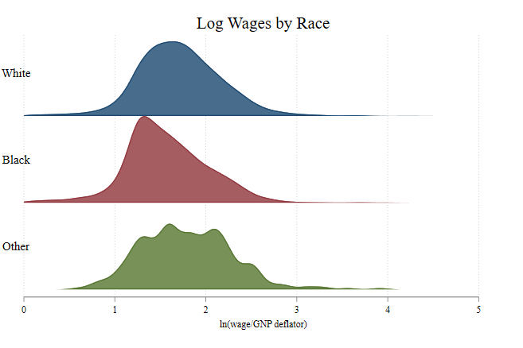
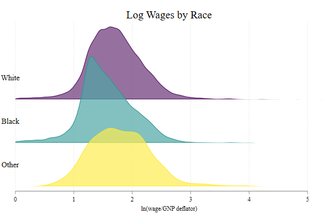
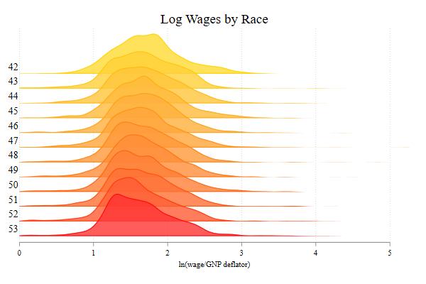

<style>
.center2 {
  display: block;
  margin-left: auto;
  margin-right: auto;
  width: 60%;
}
</style>
---

# Disclaimer

I should start by saying that what I will be presenting here is ***not*** the only way. There are other ways to create and modify your schemes however you would like to do.

That being said. The command I ll be presenting will depend strongly on a few tools built by Ben Jann.
`colorpalette` and `colorspace`. As well as `grstyle`.

I will also be using some 
I should also mention, `joyplot` only produces kernel density type type of plots. But at some point I will add the option for ridge "time/line" plots.

So let me start
 
---

## What are Joyplots?

Googling the word joyplots suggest they are:

>a series of histograms, density plots or time series for a number of data segments, all aligned to the same horizontal scale and presented with a slight overlap.

In my opinion, it seems that this kind of plots can be used to compare across many groups, providing a better visual tool than simply combining kernel density plots. 

Oh, seems now a days, people call this ridgeplots. But I will keep it as Joy.


---

## But what are they, really?

Compare to my other implementations, **`joyplots`** are not a mystery. They are simply stacked kernel densities that could be stack together, with different sets of colors that are pleasing to the eye.

If that is the case, the basic way to do a `joyplot` would be using `kdensity`, and use those results:
.panelset[
  .panel[.panel-name[Code]
  ```stata
  sysuse auto
  two kdensity price if foreign==1, recast(area) color(%80) ///
   || kdensity price if foreign==0, recast(area) color(%80)
  ```
  This simply creates two kernel densities, for prices, and recasts them as area plots
  ]
  .panel[.panel-name[plot]
  .center2[
   
   ]
  ]
]

---

## If they are so simple. then why write a code?

Again, making this type of plots is easy, when all are plotted at the floor. However keeping track of colors, heights, etc, can be hard. 

And, if you want to do this type of graphs often, then it really gets messy.

Thus, what I decided to do was write a small `ado` that makes creating this plots easy. 

In the next slides, I will show you how to use `joyplot` to make this type of plots, in Stata!. But first...

1. Get a copy of [`joyplot`](./joyplot_files/joyplot.ado)  in your computer.
2. Install Ben Jann's colorpalette commands:
```stata
net install palettes, replace ///
from("https://raw.githubusercontent.com/benjann/palettes/master/")
net install colrspace, replace ///
from("https://raw.githubusercontent.com/benjann/colrspace/master/")
```

This is a very powerful command that makes working with colors really easy!

---
```{r xaringan-panelset, echo=FALSE}
xaringanExtra::use_panelset()
```

## Simple Joyplot

Before we start with the heavy duty joyplot, Lets see how it actually works with a toy example. 

Specifically, lets start with the `auto.dta` dataset.

.panelset[
  .panel[.panel-name[Code]
  
  ```Stata
  joyplot price, byvar(foreign) 
  ```
  Notice this is very similar to kdensity, except that you indicate the groups using `byvar()`
  ]
  
  .panel[.panel-name[Plot]
  .pull-left[
   
   ]
   
  .pull-right[
    The most note worty points from this graph. There is no y-axis. and the height of all plots have been normalized. 
    
  Thus you can still compare them
    
  ]
  ]
  
   
  
]

---

## More Complex JoyPlot

Alright, this first example is just to provide the most basic version of a `joyplot`. 

There are however, many options you can play with to make your plot better looking.

```stata
joyplot varname [if] [in] [aw/], /// you can select a sample, 
                                     and use weights
[byvar(varname) /// Variable over which create the kdensities.
dadj(real 1)   /// Adjustment to density. (Stacking)
bwadj(0<#<1)   /// Adj on BW. 0 uses average, 1 uses individual bw's
bwadj2(#)      /// Adj all BW
kernel(string)   /// kernel function
notext textopt(string) /// Notext omits text on y axis.
                       /// and textopt allows for other options
colorpalette(string) /// Uses Benjans Colors with all the options. 
 gap0 /// If you want all densities to be on floor
lcolor(passthru) lwidth(passthru) ] /// Options for line

```

---

## More Complex JoyPlot 

So we are ready for some Joy!

.panelset[
   .panel[.panel-name[Code]

Lets start by getting some data

```stata
webuse nlswork
```

and create a simple joyplot for wages across race

```stata
joyplot ln_wage [w=wt], byvar(race) ///
    title("Log Wages by Race")
```

   ]
   
  .panel[.panel-name[plot]
  
  .pull-left[  ]
  .pull-right[
  
 Basic joyplot with caveats
    
- There is no overlapping
- Colors could be better
- allow for transparency?

  ]

   
   ]
]

---

## Beatify

.panelset[

   .panel[.panel-name[Goal]

The next step will be to make the plot better looking.
- How to change the stacking option (to allow for overlapping)
- Change bandwidths.
- change colors
So lets do All of this ~!
   ]
   
   .panel[ .panel-name[code]

```stata
joyplot ln_wage , byvar(race) ///
  bwadj(1) /// <- uses Individually estimated BW
	dadj(2) /// <- allows to overlap plots
	colorpalette(viridis, opacity(70)) /// <- Using Collorpalette!
    title("Log Wages by Race")
```

   
   
   .panel[.panel-name[plot]

  .center2[  ]
  
It does look much better! So lets do one even more colorful
   ]
   
   .panel[.panel-name[plot2]
.pull-right[   ]
.pull-left[
Here I use a code that changes colors, using Year of birth for groups

```stata
joyplot ln_wage if ///
inrange(birth_yr,42,53) ///
, byvar(birth_yr) bwadj(1) ///
dadj(3)  ///
colorpalette(gold red, opacity(80)) ///
title("Log Wages by Race") 
```
]
]  
]
   
]

---

## Conclusions

This was fun to code, and flex my programming muscles.

More important, I wanted make an "easy" way to construct this figures.

There is still some details to address. Specifically, allow for histograms, and time lines. I also want to add labels automatically. but everything step by step

Comments? suggestions? Drop me a message!

.center2[]

