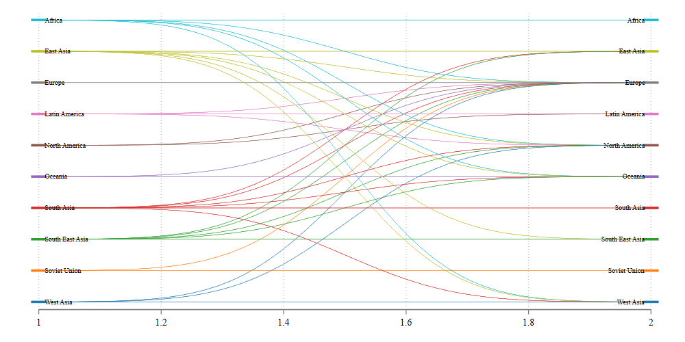
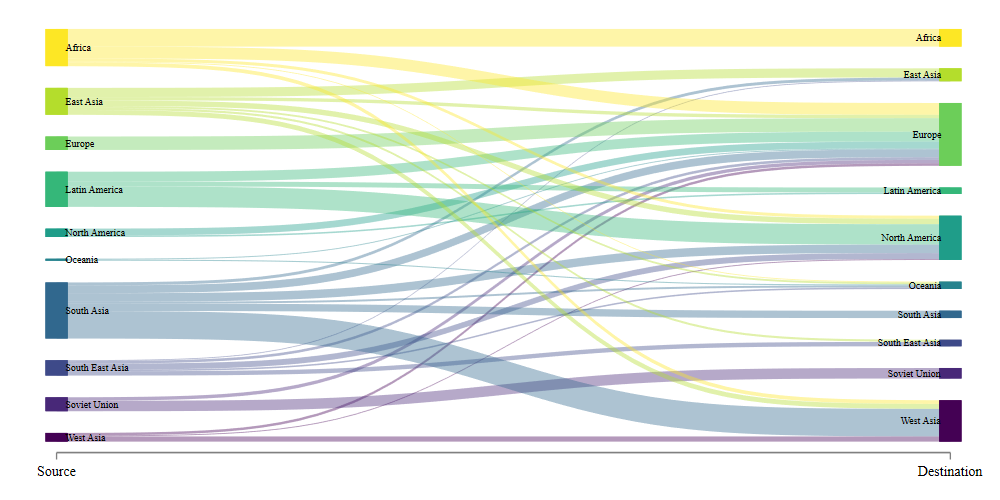

<style>
.center2 {
  display: block;
  margin-left: auto;
  margin-right: auto;
  width: 90%;
}
</style>
---

# Disclaimer

I should start by saying that what I will be presenting here is ***not*** the only way. Just they way I like to make this kind of plot, specially after some programming muscle flexing, and when I do not want to type the same text over and over again.

That being said. A step by step guide on this plot can be found [here](https://medium.com/the-stata-guide/stata-graphs-sankey-diagram-ecddd112aca1). 

Learning how to do it step-by-step gives your more flexibility, but I hope you will find that using [`sankey_plot`](./sankey_files/sankey_plot.ado) is sufficiently flexible for most of your purposes. Of course, you should also download the helpfile [`sankey_plot`](./sankey_files/sankey_plot.sthlp) since it has more examples inside. Here I just cover basics

Also, I just found out that there is a python application that was linked to Stata! You can find a link to application [here](https://www.mjcrowther.co.uk/software/sankey/)

So let me start
 
---

## What are Sankey plots?

According to Wikipedia, Sankey plots are :

> A type of flow diagram in which the width of the arrows is proportional to the flow rate.

> And are often used in the visualization of material flow analysis.


---

## But what they, really?

When you think about it, at its core, Sankey plots are nothing more then graphs of connected coordinates. 

You have the origin point $(x0,y0)$ and the destiny point $(x1,y1)$, and you simply connect them with a line. Sounds Familiar? 

If that is the case, you could easily plot "ugly" Sankey plots using `Stata` command `pcspike`. The caveat: `pcspikes` draws straight lines, but Sankey uses nice smooth ones.

.pull-left[

]
.pull-right[

]

---

## But what they, really?

There are smaller details that go with it, but, as long as you have a set of pair coordinates, you can easily connect them, and voila! **Sankey plot**.

Getting the curved lines, however, may seem like a hassle. And even more if you are trying to keep track of all the elements connections, colors, etc. Thus, what I decided to do was write a small `ado` that makes creating this plots easy. 

In the next slides, I will show you how to use `sankey_plot` to make this type of plots, in Stata!. But first...

1. Get a copy of [`sankey_plot`](./sankey_files/sankey_plot.ado) and [`sankey_i`](./sankey_files/sankey_i.ado) in your computer. 
2. Get a copy of [`sankey_plot.sthlp`](./sankey_files/sankey_plot.sthlp).
3. Get Asjad `schemepack` from SSC. Not necessary, but the white background is handy.
4. Get some of the example datasets: 
  - [dogs_and_happiness.dta](./sankey_files/dogs_and_happiness.dta)
  - [immigration.dta](./sankey_files/immigration.dta)
  - [jobmarket.dta](./sankey_files/jobmarket.dta)
  
`sankey_i` and `sankey_plot` are independent from each other, but it will help you understand the data structure, and how the command works.

---
```{r xaringan-panelset, echo=FALSE}
xaringanExtra::use_panelset()
```

## Simple Sankey plot

Before we start with the heavy duty Sankey plot, Lets see how it actually works with a toy example.

Say that you want to Sankey-sh connection between two points. (0,0)-(1,1). 
What you would do is:

.panelset[
  .panel[.panel-name[Code]
  
  ```Stata
  sankey_i 0  0  1  1
    *->   x0 y0 x1 y1
  ```
  Notice with this command, you *feed* information for the two points you want to connect (x0,y0) to (x1,y1).
  
  The plot now will be almost identical to the one I produced before. The difference is that we can also play with other graph properties
  ]
  
  .panel[.panel-name[Plot]
  .center2[
   
   ]
  ]
  
   .panel[.panel-name[Code]
  
  ```Stata
  sankey_i 0  0  1  -3  0.2 0.5
    *->   x0 y0 x1 y1   W0  w1
  ```
  In this example, I change the second coordinate, and add two other values. W0 (for width at point 1) and W1 for width at point 2.
  ]
  
   .panel[.panel-name[Plot2]
  
   .center[]
  
  ]
  
]

---

## More Complex Sankey Plot

Alright, the idea of using `sankey_i`, is for you to become familiar with the order of the data you will need to have to produce a Sankey plot. 

Namely, you will need data for each pair of *links* you want to make (say `x0, y0, x1, y1`), but also variables with information about the Widths.

The basic syntax of the command, then will be:

```stata
  sankey_plot vx0 vy0 vx1 vy0, <--necessary
  [width0(varname) <-- Var with WIDTH point0
   width1(varname) <-- Var with WIDTH point1 
   color(varname)  <-- Var with color 
   pstyle(varname) <-- Var with pstyle
   adjust extra    <-- Adjusts Nodes possition
   Other options]  <-- other code options
```

for more details on syntax, see the helpfile.

---

## More Complex Sankey Plot 

.panelset[
   .panel[.panel-name[Input Data]
Lets load some data:
   
```stata
 use immigration.dta
 list in 1/10, sep(0)
      +-------------------------------------------------------+
     |            from                to     value   x0   x1 |
     |-------------------------------------------------------|
  1. |          Africa            Africa   3.14247    1    2 |
  2. |       East Asia         East Asia     1.631    1    2 |
  3. |      South Asia         East Asia   .525881    1    2 |
  4. | South East Asia         East Asia   .145264    1    2 |
  5. |          Africa            Europe   2.10788    1    2 |
  6. |       East Asia            Europe   .601265    1    2 |
  7. |          Europe            Europe   2.40148    1    2 |
  8. |   Latin America            Europe   1.76259    1    2 |
  9. |   North America            Europe   1.21593    1    2 |
 10. |         Oceania            Europe    .17037    1    2 |
     |-------------------------------------------------------|
```
   
   ]
   
   .panel[.panel-name[plot code]
Create a simple sankey plot. the coordinates should be added in the same order as with `sankey_i`. In this case, y0 and y1 are "from" and "to"

```stata
sankey_plot x0 from x1 to
```

]
   
      
   .panel[.panel-name[plot]
  
  .center[ ]
    
   
   ]
]

---

## Beatify

.panelset[
   .panel[.panel-name[Goal]

The first plot was not very nice looking, so here I will just make it look nicer, by adding some options:

- How to change width's
- Adjust graph to width's
- Assign colors
- change labels

So lets do All of this at once!
   ]
   
   .panel[.panel-name[code]


```stata
sankey_plot x0 from x1 to, ///
width0(value) /// Adds Width info
extra adjust /// Adjusts coordinates
colorpalette(viridis, opacity(40)) /// adds color options(if installed)
gap(0.1) noline /// adds spaces between nodes, and drops lines in flows
xlabel(1 "Source" 2 "Destination", nogrid) // Modifies Xlabels

```

   ]
   
   .panel[.panel-name[plot]

  .center[ ]

   ]
   
]
   
]

---

##  What about Multiple levels?

.panelset[

.panel[.panel-name[Mlevels]
   
The first example shows you how to do a Sankey plot across 2 levels. (source and destination). 

However, you could also try doing this for multiple levels.
For this, lets use the jobmarket data

]

.panel[.panel-name[Data]

```stata
use jobmarket,clear
. list in 1/10, sep(0)
     +----------------------------------------------------------------------------------+
     | y0   y1   week0   week1                 label0                 label1   candid~s |
     |----------------------------------------------------------------------------------|
  1. |  1    1       0       1     Jobs Applied to 32             Replies 15         15 |
  2. |  1    2       0       1     Jobs Applied to 32           Rejections 5          5 |
  3. |  1    3       0       1     Jobs Applied to 32            No Reply 12         12 |
  4. |  1    1       1       2             Replies 15   Initial Interviews 9          9 |
  5. |  1    2       1       2             Replies 15     Replied too late 6          6 |
  6. |  1    1       2       3   Initial Interviews 9       Task Requested 4          4 |
  7. |  1    2       2       3   Initial Interviews 9     No Task Required 1          1 |
  8. |  1    3       2       3   Initial Interviews 9       Rejected by me 2          2 |
  9. |  1    4       2       3   Initial Interviews 9           Rejections 2          2 |
 10. |  1    1       3       4       Task Requested 4      Final Interview 5          4 |

```

]

.panel[.panel-name[Code]

```Stata
sankey_plot week0 y0 week1 y1, width0(candidates) /// adds width
adjust extra /// adjusts coordinates 
xlabel(0 " " 1 "Week 1" 2 "Week 2" 3 "Week 3" ///
4 "Week 4" 5 "Week 5" 6 "Week 6", nogrid) /// Modifies xlabels
fillcolor(gs12%50) /// changes colors
label0(label0) label1(label1) /// adds labels 
xsize(10) ysize(6) // and changes sizes
```
]
.panel[.panel-name[plot]
.center2[]]


]

---
## Using Wide Data structure

.panelset[

  .panel[.panel-name[Wide Data]

The other option for using `sankey_plot` is with wide data.

In this case, levels are not defined by "x0 x1" but rather by the number of variables in your data.

Consider the dog and happiness dataset
```stata
use dogs_and_happiness, clear
list
     +------------------------------------------+
     |     married       pet       happy   freq |
     |------------------------------------------|
  1. | Married:Yes   Pet:Yes   Happy:Yes      5 |
  2. | Married:Yes   Pet:Yes   Happy:Yes      4 |
  3. | Married:Yes    Pet:No   Happy:Yes      3 |
  4. |  Married:No   Pet:Yes   Happy:Yes      2 |
  5. |  Married:No    Pet:No    Happy:No      1 |
     +------------------------------------------+
```
  ]
  
.panel[.panel-name[code]
In this case, we have 3 levels (defined by married, pet, and happy). 

If you want to use this, you NEED to use "wide" option. You also need to provide a `width`.Here I also add other options to make the graph look pretty:

```Stata
sankey_plot married pet happy , wide width(freq) /// Basic for wide data
  fillcolor(%50) /// Some color properties
  xlabel("",nogrid) gap(0.1) tight /// more of a gap, with tight groups
  title("The Secret to  Happyness") /// Title and 
  subtitle("Have Pets: Nora and Bruce!") /// subtitle
  note("Nora and Bruce belong to my wife and I") // and a note
```
]
.panel[.panel-name[plot]
  .center[]
]


]

---

## Conclusions

This was fun to code, and flex my programming muscles.

More important, I wanted make an "easy" way to construct these figures in `Stata`.

Many details have been addressed, but always open to add other options.

Comments? suggestions? Drop me a message!

.center[]

