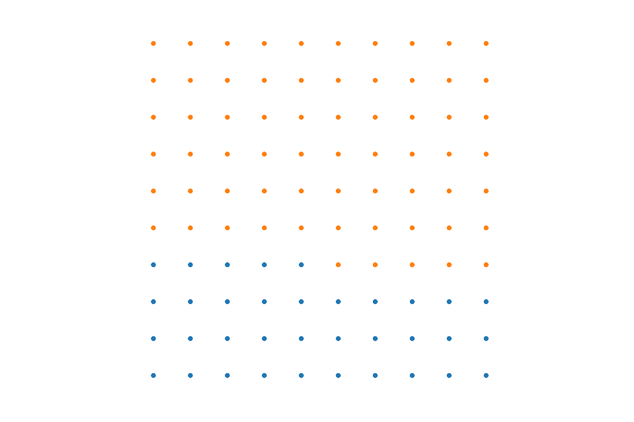
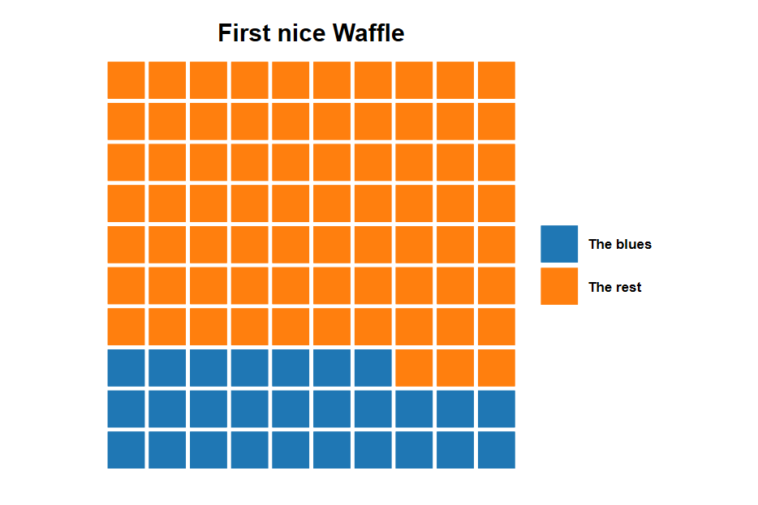
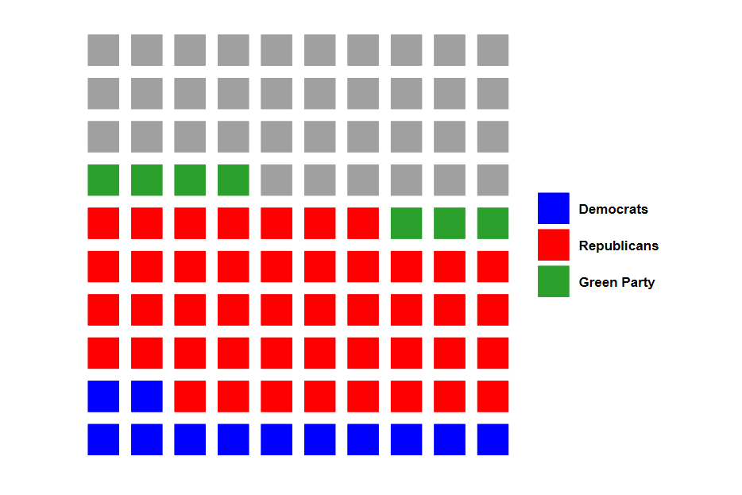
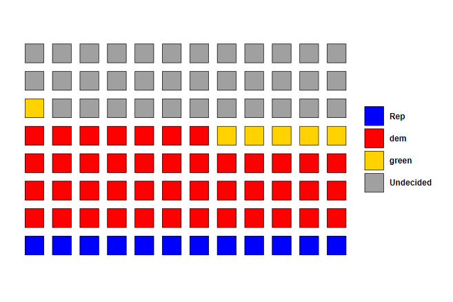
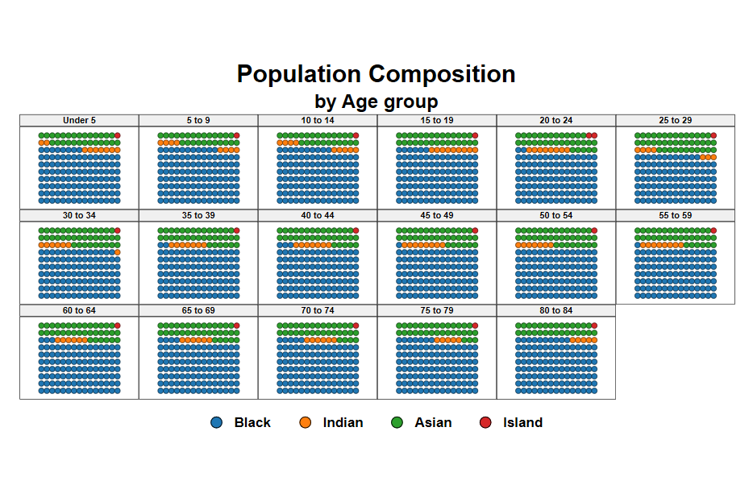
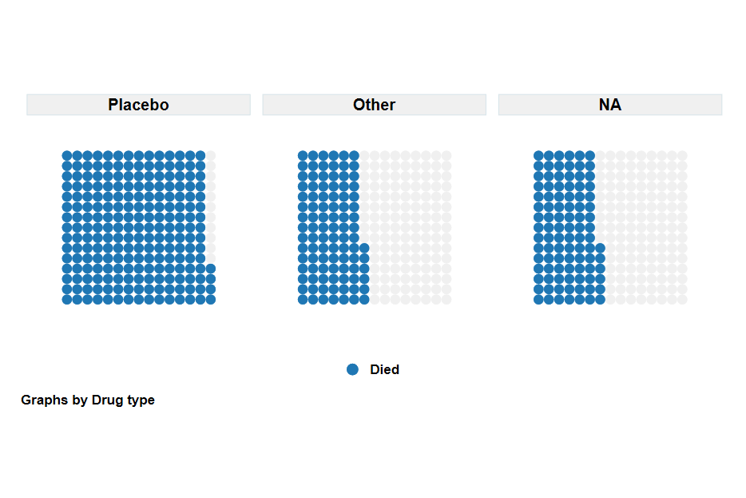
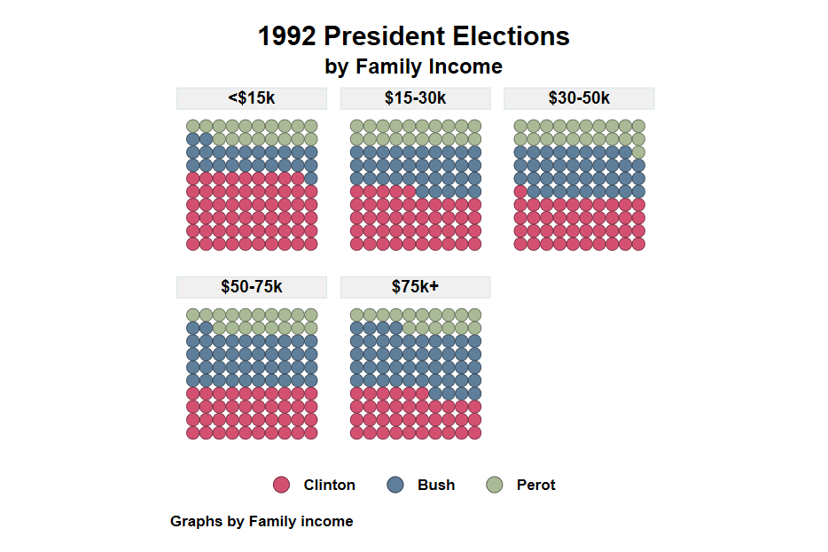

```{r  , echo=FALSE}
xaringanExtra::use_tile_view()
xaringanExtra::use_panelset()
xaringanExtra::use_share_again()
xaringanExtra::use_clipboard()
```

<style>
.center2 {
  display: block;
  margin-left: auto;
  margin-right: auto;
  width: 80%;
}
</style>


---

# Disclaimer

I should start by saying that what I will be presenting here is ***not*** the only way. Just they way I like to make this kind of plot, specially after some programming muscle flexing, and when I do not want to type the same text over and over again.

That being said. A step by step guide on this plot can be found [here](https://medium.com/the-stata-guide/stata-graphs-waffle-charts-32afc7d6f6dd). 

Learning how to do it step-by-step gives your more flexibility, but I hope you will find that using [`waffle_plot`](./waffle_i_files/waffle_plot.ado) is sufficiently flexible for most of your purposes.

Also, just recently, Jared Colson came up with his own version (`ssc install waffle`). My program is quite similar, but has extra features. We may even "merge" both.

So let me start
 
---

## What is a waffle plot?

A *waffle* plot is a kind of *pie* chart (how interesting we like to name them as food), because it can be used to visualize sample compositions. It can also be considered as a stacked ***bar*** chart.

In contrast with a pie chart, where the information is displayed as pieces of a circle, a waffle plot shows the composition as dots in a box. Incidentally, it does look like a waffle...

```{r, echo=FALSE, out.width="40%", fig.cap="", center}
knitr::include_graphics("https://assets.epicurious.com/photos/60637186ceabd6ae3d2ebc7f/4:3/w_4136,h_3102,c_limit/CrispyWaffles_HERO_v2_032521_12048_JD_final.jpg")
```

---

## But what are they, really? 

If you want a more insider look of a waffle plot. They are nothing else than a ***scatter*** plot within a box, where all points and horizontally and vertically equidistant.

This limits the resolution of the information you can display. For example in a 10x10 scatterplot, you can differentiate between 13.6 and 13.7.

So at its core Waffle plots are easy to make. But they can be a bit time consuming. 

Thus, what I decided to do was write a small `ado` that makes creating this plots easily. 

In the next slides, I will show you how to use `waffle_plot` to make this type of plots, in Stata!. But first...

1. Get a copy of [`waffle_plot.ado`](./waffle_i_files/waffle_plot.ado) in your computer, as well as its helpfile [`waffle_plot.sthlp`](./waffle_i_files/waffle_plot.sthlp) 
2. Get Asjad `schemepack` from SSC. `white_tableau` scheme simple and good looking!. (But Soon i will show you how to add even more color!)

---

## Simple waffle plot

Say that you want to do a waffle plot, and want to show that 35% of individuals do something. If so, you will type:

.pull-left[
```Stata
waffle_plot 27 
```
When used like this, waffle_plot acts like an immediate command. You just feed it data, and it makes the waffle.

However, as you can see on the right, the simple waffle is not very attractive. So lets try improve on it.
]
.pull-right[

]

---

## Beautify

.panelset[
  .panel[.panel-name[Code]
  You can change the size and symbol. However, you need transfer that infor using sctopt (scatter options).
  
```Stata 
    waffle_plot 27, sctopt( msize(7)        /// Increase size of Dots
          msymbol(square)) /// and change them to Squares
          legend(order(1 "The blues" 2 "The rest")) /// ads Labels
          title("First nice Waffle")
``` 
  
  ]

.panel[.panel-name[Plot]
  
.center2[]
  
  ]
  
.panel[.panel-name[Code]
  
```Stata 
waffle_plot 12 45 7, /// lets use 3 groups
sctopt(msize(6) msymbol(square)) /// with some sct options
color0(gs10) /// adding color to the "rest" category
color(blue red) // and to the other two
legend(order(1 "Democrats" 2 "Republicans" 3 "Undecided"))
``` 
  
  ]

.panel[.panel-name[Plot]
  
.center2[]
  
  ]
  
.panel[.panel-name[Code]

  
```Stata 
waffle_plot .12 .45 .07, /// Uses numbers between 0-1.
sctopt(msize(6) msymbol(square) mlcolor(black)) /// Other SCT options
color0(gs10) color(blue red gold) /// Color for rest and the rest
legend(order(1"Rep" 2 "dem" 3 "green" 4 "Undecided")) xnobs(12) ynobs(8)

``` 

]

.panel[.panel-name[Plot]
  
.center2[]
  
  ]
  
]


---
## Further use: Beyond immediate 
.panelset[
.panel[.panel-name[Goals]
The previous slide shows how to produce waffle plots providing the data you want to plot. But what if you want to use your own data.

You can check some examples next. I mixed and match many options.

Also, whenever you use "by", titles and subtitles have to go within "by()".

This is something I ll ask to be changed! but for now...
]

.panel[.panel-name[Code]

```Stata
sysuse pop2000, clear
waffle_plot black indian asian island, /// provides 3 variables with Pop for each
legend(order(1 "Black" 2 "Indian" 3 "Asian" 4 "Island") cols(4)) ///
sctopt(msize(3) mlcolor(black) ) /// Scatter options
total  /// This is different. Im asking to construct shares internally
by(agegrp, title("Population Composition") /// Using by(), Notice (sub)Title
compact subtitle("by Age group") note("") cols(6)) /// and Cols
xnobs(15)  // Just Because I want to show a rectangle
```

]

.panel[.panel-name[plot]
.center2[]

]

.panel[.panel-name[Code]

Comparing Drug efficacy
```Stata
sysuse cancer, clear
waffle_plot died, ///
color0(gs15) /// Color for the left out 
legend(order(1 "Died")) /// Legend
by(drug, cols(3)) sctopt(msize(3)) ///
flip nobs(15) // two new things. FLIP and increase to 15x15
```
 

]

.panel[.panel-name[plot]
.center2[]

]

.panel[.panel-name[Code]

1992 Presidential elections
```Stata

sysuse voter, clear
xi, noomit:waffle_plot i.cand [w=pop], /// Notice weights, and "factor"
color(cranberry*0.7 navy*0.7 forest_green*.5) /// Special colors
sctopt(msize(4) mlcolor(black%50)) ///
by(inc, title("1992 President Elections") subtitle("by Family Income")) ///
legend(order(1 "Clinton" 2 "Bush" 3 "Perot") cols(3))
```

]
.panel[.panel-name[plot]
.center2[]

]

]  


---

## Conclusions?

What else can I do?

Because `waffle_plot` is just a collection of scatter plots, you can use most `twoway graph` options with this command. Although I have not tried all of them. So handle with care. 

When using by(), remember adding titles and notes within by(). (Weird I know)

In any case, this command does the heavy lifting, you can do the fineness.

But what is next?

Right now it produces rather slow graphs when by() is used. Perhaps I can do my own version of it that is faster. 

Comments? suggestions? Drop me a message!


