```{r setup, include=FALSE}
options(htmltools.dir.version = FALSE)
knitr::opts_chunk$set(
  fig.width=8, fig.height=6, fig.retina=3,
  out.height = "100%",
  cache = FALSE,
  echo = TRUE,
  message = FALSE, 
  warning = FALSE,
  hiline = TRUE
)
library(tidyverse)
library(wooldridge)
library(fixest)
```

class: center, middle, inverse

## What do we mean with Inference? 

--

## how does it change what we normally do??

--

## why do we care???

---

## Recap

- What do we know so far?

--

Say that we are estimating a linear model
$$y=\beta_0 + \beta_1 x_1 + \beta_2 x_2 + ... + \beta_k x_k + u$$
-- 

To obtain .blue[BLUE] estimates, we needed some assumptions.

--

MLR1. Linear in parameters (need a econometric model)

MLR2. Random sample (and good data)

MLR3. No perfect collinearity (including with the intercept), and be sure Math can be done to it)

MLR4. Zero conditional mean (Because we care about causal effects)

MLR5. Homoscedasticity (to estimate standard errors)


---

## What about Standard Errors

We have also figured what the expression for standard errors of the estimated coefficents would be:

--

For a given model:

$$y=\beta_0 + \beta_1 x_1 + \beta_2 x_2 + ... + \beta_k x_k + u $$
The beta coefficients could be written as follows:

$$\hat\beta_k = \sum w_i y_i = \beta_k + \sum w_i e_i$$
--

This gives you most of the properties of $\beta's$. 
- If the $E(w_i e_i)=0$, $\beta's$ are unbiased.

- And the variance of $\beta's$ depend on the variance of the errors (weighted variance.)

---

# Standard errors of Betas

- Remember, this measure is a proxy of the level of precision of the estimated parameters. Which are easy to obtain:

$$Var(\hat\beta_k)=Var\left(\sum w_i e_i \right)=\sum \left(w_i^2 \ Var(e_i) \right) + \sum_i \sum_{j\neq i}(w_i w_j \ Cov(e_i,e_j))$$
--

- Because we assume independent sampling (observations are independent from each other) $Cov(e_i,e_j)=0$.

--

- And because we assume Homoskedasticity $Var(e_i) = Var(e_j) = \sigma^2 _e$. This simplyfies the math:

$$Var(\hat\beta_k) = \sigma^2 _e \sum w_i^2$$
---

class: center, middle , inverse

## But is it enough for Inference??

--

## any guesses?

--

## what do we mean with statistical inference?

---

## what do we mean with statistical inference?

- Many meanings, but similar uses:

--

  - Hypothesis tests about population parameters. Can we say something about the population?

--

  - Construction of confidence intervals. We know point estimates are wrong, but what about ranges?

--

  - General assessment regarding the precision of your estimates. How sure you are about your results?

--

- For this, is not enough known Means and variances, we need to know the distributions of the OLS estimators.

--

But **why**?

---

class: center, middle , inverse

# Not all distributions are equal
 
---

## Not all distributions are equal

.panelset[
.panel[.panel-name[Concept]
- Knowing only mean and standard deviation may not be enough to draw conclusions, because different distributions will have different shapes, thus different confidence intervals.
]
.panel[.panel-name[Dist1]
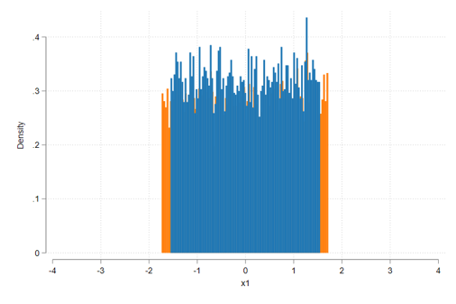
]
.panel[.panel-name[Dist2]
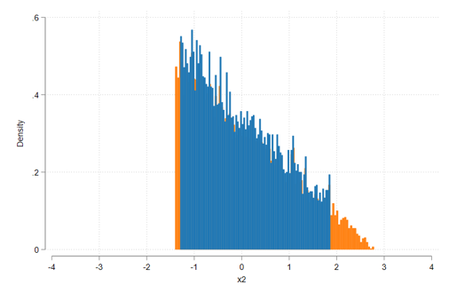
]
.panel[.panel-name[Dist3]
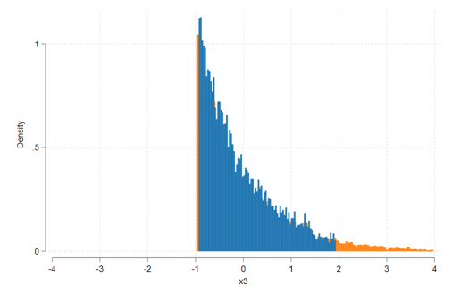
]
.panel[.panel-name[Dist4]
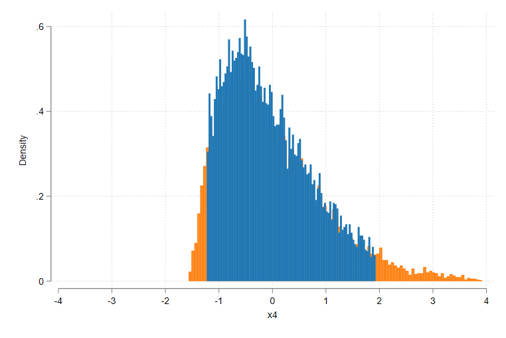
]

.panel[.panel-name[so?]

- But if that is the case, then, what can we do? or what would we want?

--

- you want, symetry, stablity, and well known properties....

--

- you want normality!
]
]


---

class: center , middle, inverse

## How do we achieve normality on the coefficients?

---

## Recap

- Estimated coefficients $\hat\beta's$ are random parameters that depend on the sample:

$$\hat\beta = \beta + \sum w_i e_i$$
- So all variation in $\hat\beta$ come from sampling errors $e_i$. Thus also its distributional properties! 

--

- If the errors are normal, then $\hat\beta$ will also be normal.

- Thus, if we impose normality assumption on $e_i$, $\hat\beta's$ will also be normal, and we can obtain CI, and run hypothesis testing.

  > Normality assumption is a simplyfying assumption, but is **NOT** a necessary assumption!

---

## Assumptioon MLR6: Normality of the errors

Errors are iid Normal:
$$u_i \sim N(0,\sigma^2)$$

which does not depend on $X's$

--

So, if $u_i \sim Normal \rightarrow y_i \sim Normal$  and $\hat\beta$ are also normal.

--

MLR1-6 constitute the classical Linear model assumptions

---

## Why normality, why do we like it?

1. Its a distribution that *develops* often in real data.

2. Its a distribution with well known properties.

3. Combination of normal distributions generate a normal distribution, and sum of squared normals, generate a Chi2.

4. Under Normality OLS is the BUE. Best unbiased estimator!

---

## But is it a reasonable assumption?

perhaps:

--

- The error term is the sum of **many** different unobserved factors, and the sums of "many" independent factors are often normally distributed.

--

- But, in practice, errors are a **bag of holdings** that combine too many factors in uncertain ways. Thus normality may fail (Empirical question), and would be overall questionable.

- So what to do when normality fails???

  - you can transform the data or improve model specification. But if all fails?

--

- **Nothing**. Normality is an assumption of convenience. You do not needed!

---


## Example: Testing for normality

.panelset[
.panel[.panel-name[Code]
  ```stata
  ssc install color_style
  set scheme white2
  bcuse wage1, clear
  gen lnwage=log(wage)
  reg lnwage educ exper tenure
  predict residual1, res
  kdensity residual1, normal xsize(9)
  
  reg wage educ exper tenure
  predict residual2, res
  kdensity residual2, normal xsize(9)
  
  ```
  
]
.panel[.panel-name[Figure1]
.center[
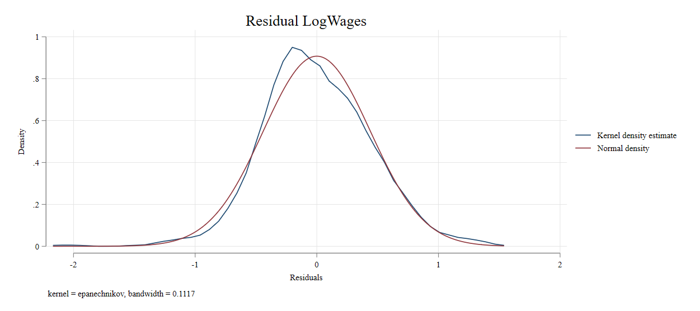
]
]

.panel[.panel-name[Figure2]
  
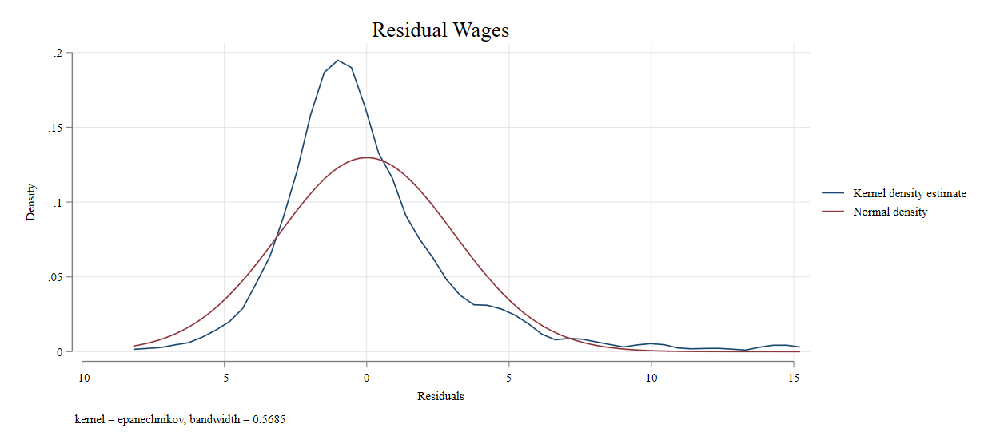

]

.panel[.panel-name[Alt Code]
```stata
sktest residual1 residual2

                                                         ----- Joint test -----
    Variable |       Obs   Pr(skewness)   Pr(kurtosis)   Adj chi2(2)  Prob>chi2
-------------+-----------------------------------------------------------------
   residual1 |       526         0.8403         0.0007         10.59     0.0050
   residual2 |       526         0.0000         0.0000        135.61     0.0000

```
But again, if Normality fails, do not worry! if N is large, normality is not necessary!

]


]

---

## Some Terminology:

Gauss-Markov assumptions: MLR1-MLR5
CLM assumptions: MLR1-MLR6

and under normality assumption (again not necessary)

$$\hat\beta_k\sim N(\beta_j,\sigma^2_{\beta_j}) \rightarrow \frac{\hat\beta-\beta}{\sigma_\beta }\sim N(0,1)$$
However, we almost never know $\sigma_beta$ (Standard Deviation), but instead we know the Standard error $\hat\sigma_\beta$. 

--

What difference it makes? The standardized coefficient is no longer distributed as normal, but as **t-student**.

$$\frac{\hat\beta-\beta}{\hat\sigma_\beta }\sim t(N-k-1)$$
--

but as $N \rightarrow \infty$ , $t(N-k-1) \sim N(0,1)$

---

## Hypothesis Testing: Steps to follow

**1** What is the null-hypothesis ? What is the "truth" you are trying to test

$$H_0 : \beta_k = c$$

Here the null is assume that $\beta_k$ (true Beta) is equal to a constant $c$. 

This hypothesis refers to the true/population parameter. And we use sample data to provide some evidence in favor or against this hypothesis. 

--

**2** Set your alternative hypothesis. 

What are the options? 
  - Two tails. $H_1 : \beta_k \neq c$. 
  - one tail. $H_1 : \beta_k > c$ or  $H_1 : \beta_k < c$. 

--

Two tails is often the most common, but one tail is also useful. 

For coefficients, Most software provide only two-tails tests.

---

## Hypothesis Testing: Steps to follow

**3** Construct your t-Statistic (for coefficients)

$$t=\frac{\hat\beta-\beta}{\hat\sigma_\beta}$$
**4** Compare this to the corresponding critical values. If $t$ is too large, then $H_0$ is rejected. Otherwise, it is **not** rejected

> Remember, you never accept the Null, you simple say there is not enough evidence to say it is not true.

---

## How it works?

.panelset[

.panel[.panel-name[t-dist]
  .pull-left[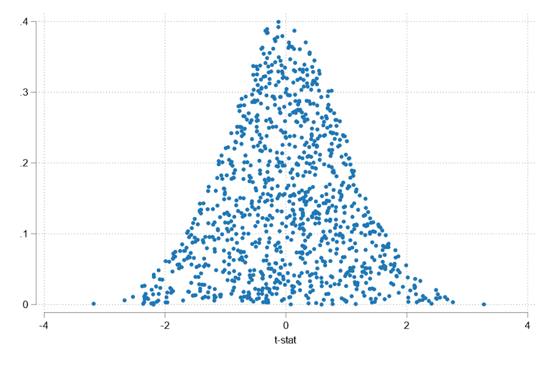]
  .pull-right[If you were to run the same regression thousand of times, the distribution of the t-statistics would look like this]
]
.panel[.panel-name[H0: t > 0]
.pull-left[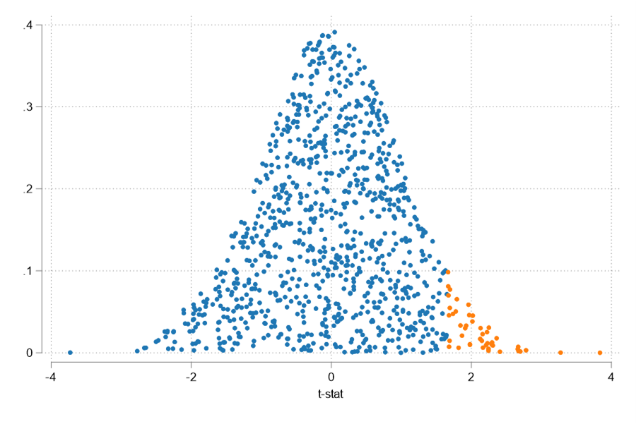]
.pull-right[The closer one is to zero, then, the most likely is that the Null was true.

But further values, while still possible, are less likely to belong to the distribution]

]
.panel[.panel-name[H0: t < 0]
.pull-left[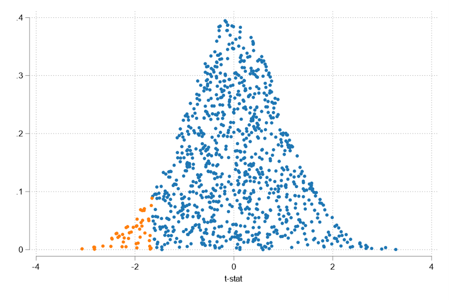]
.pull-right[
This "orange" areas are known as the rejection areas. If the t-stat one estimates fall in them, you reject your Null. 
]

]
.panel[.panel-name[H0: t Not Equal to 0]
.pull-left[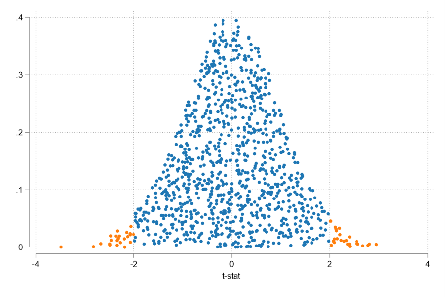]

.pull-right[
And the difference between one or two tails tests is that the rejection areas are either on one side only, or both sides.
]

]
]

---

## Example: Wage Regression

```stata
. reg logwage educ exper tenure

      Source |       SS           df       MS      Number of obs   =       526
-------------+----------------------------------   F(3, 522)       =     80.39
       Model |  46.8741776         3  15.6247259   Prob > F        =    0.0000
    Residual |  101.455574       522  .194359337   R-squared       =    0.3160
-------------+----------------------------------   Adj R-squared   =    0.3121
       Total |  148.329751       525   .28253286   Root MSE        =    .44086

------------------------------------------------------------------------------
     logwage | Coefficient  Std. err.      t    P>|t|     [95% conf. interval]
-------------+----------------------------------------------------------------
        educ |    .092029   .0073299    12.56   0.000     .0776292    .1064288
       exper |   .0041211   .0017233     2.39   0.017     .0007357    .0075065
      tenure |   .0220672   .0030936     7.13   0.000     .0159897    .0281448
       _cons |   .2843595   .1041904     2.73   0.007     .0796756    .4890435
------------------------------------------------------------------------------

.display invt(522,.975)
1.9645189
. display invt(522,.95)
1.6477779
. display invt(522,.99)
2.3335127
```

---

## What does "Statistically significant" mean?

- In a regression, Statistically significant variables are those for which we reject the null hypothesis $\beta_k = 0$.

- Statistically significant usually means:
  > There is enough evidence that you can reasonably say, with X% of confidence, that the coefficient is different from zero.
  
- This can also be related to the precision of the estimates. If an estimate is very precise, (small StdErr) then you can reasonably the null.

---

## What if your 't' is small ?

- if your "t" is small, you cannot reject the null. However, it doesn't mean you "accept it".

- For example, many competing null's could be simultaneously "not-rejected". For example, you cannot reject that $\beta=0$ nor that $\beta=0.1$. It doesn't mean both are true.

- Also remember: your Null can be something different from zero

---

## How to choose the right "critical value"

- Critical values will depend on the chosen **significance level**. 

- This significance levels relates to how much you want to avoid an *type I error* (chances of rejecting the Null when it is true)

  - Implicitly this means your null have to be well informed, and only with "strong" evidence you will reject it.
  
- This also means there is no 0% significance! (critical value would be infinity!)  

---

class: center , middle, inverse

# Are there other options?

---

## Are there other options?

- Yes!. Instead of relying on an "arbitrary" critical value or significance levels (which you may choose to manipulate), you can also calculate the **p-value** of your estimate.

- This is the smallest significance level at which you can reject the null hypothesis.

--

- But, how to estimate it?

  1. Estimate the t-statistic for your coefficient $t_\beta$. Determine degrees of freedom ($N-k-1$)
  2. Given the distribution, calculate share of values that would be larger, than the absolute value of this statistic. This is, $P( t > |t_\beta|)$
  
  3. If 2-tails, multiply the above value by 2.
  
  4. If 1-tail, use it as is.

---


## Stata Example

```stata
reg logwage educ exper tenure

      Source |       SS           df       MS      Number of obs   =       526
-------------+----------------------------------   F(3, 522)       =     80.39
       Model |  46.8741776         3  15.6247259   Prob > F        =    0.0000
    Residual |  101.455574       522  .194359337   R-squared       =    0.3160
-------------+----------------------------------   Adj R-squared   =    0.3121
       Total |  148.329751       525   .28253286   Root MSE        =    .44086
------------------------------------------------------------------------------
     logwage | Coefficient  Std. err.      t    P>|t|     [95% conf. interval]
-------------+----------------------------------------------------------------
        educ |    .092029   .0073299    12.56   0.000     .0776292    .1064288
       exper |   .0041211   .0017233     2.39   0.017     .0007357    .0075065
      tenure |   .0220672   .0030936     7.13   0.000     .0159897    .0281448
       _cons |   .2843595   .1041904     2.73   0.007     .0796756    .4890435
------------------------------------------------------------------------------
* Alternative: 
* H0 B_educ=0.1 
display (_b[educ]-.1)/_se[educ]
* t= -1.0874616. Pvalue
display 1-t(522,-1.0874616) ";" 2*(1-t(522,-1.0874616))
* pvalue 1-tail: .138667 ;  2-tail: .277334
* OR:
test educ=0.1
```

---

### Guidelines for discussing Economic and Statistical Significance

- If a variable is statistically significant, discuss the magnitude of the coefficient to get an idea of its economic or practical importance

  - The fact that a coefficient is statistically significant does not necessarily mean it is economically or practically significant!

--

- If a variable is statistically and economically important but has the “wrong” sign, the regression model could be misspecified. Or you may have found interesting evidence.

--

- If a variable is statistically insignificant at the usual levels (10%, 5%, or 1%), one may think of dropping it from the regression (not always recommended). 
  
  - Non-significant results are still important results!
  
--

- If the sample size is small, effects might be imprecisely estimated so that the case for dropping insignificant variables is less strong

- But if the sample size is too large, everything may look significant, even if they are not economically important. 

---

class: center , middle, inverse

.center[

]

---

## Confidence Intervals

- There is a third approach: .blue[Construction of Confidence Intervals]. 

- The idea is simple. Point estimates are always wrong, however, we may do better if we provide confidence intervals. A range of values you believe the true parameter may be.

--

- This is an alternative view to Hypothesis testing. 

- given the distribution of parameters (t or N), it is possible to construct CI using the following identity:

$$P(\hat\beta-t_c*\sigma_\hat\beta \leq \beta \leq \hat\beta+t_c*\sigma_\hat\beta)=0.95$$
- Which gives you an idea of the precision of your estimate. 

--

- Also, if Zero is within the CI, the coefficient is not signficant. (it could be zero)

---

## How to Interpret Confidence Intervals?

.panelset[

.panel[.panel-name[Interpretation]

- Wrong: A 95% CI is such that it has 95% chances of covering the true parameter.

- Right: A 95% CI is such that it will cover the true parameter 95% of the time.
]

.panel[.panel-name[CI]

.center[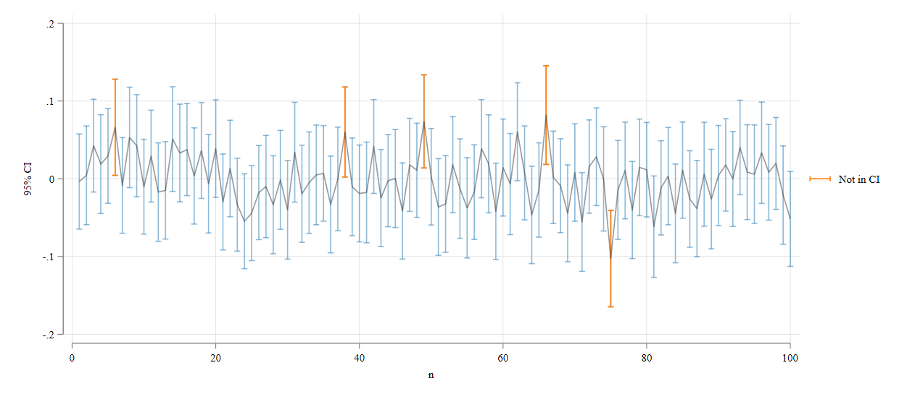 ]
]

.panel[.panel-name[T-stats]
.center[ ]
]


]


---

## Stata Example

```stata
reg logwage educ exper tenure

      Source |       SS           df       MS      Number of obs   =       526
-------------+----------------------------------   F(3, 522)       =     80.39
       Model |  46.8741776         3  15.6247259   Prob > F        =    0.0000
    Residual |  101.455574       522  .194359337   R-squared       =    0.3160
-------------+----------------------------------   Adj R-squared   =    0.3121
       Total |  148.329751       525   .28253286   Root MSE        =    .44086
------------------------------------------------------------------------------
     logwage | Coefficient  Std. err.      t    P>|t|     [95% conf. interval]
-------------+----------------------------------------------------------------
        educ |    .092029   .0073299    12.56   0.000     .0776292    .1064288
       exper |   .0041211   .0017233     2.39   0.017     .0007357    .0075065
      tenure |   .0220672   .0030936     7.13   0.000     .0159897    .0281448
       _cons |   .2843595   .1041904     2.73   0.007     .0796756    .4890435
------------------------------------------------------------------------------
```

---

class: center , middle, inverse

# Lets make this interesting

--

## Testing Linear Combinations

---

## Testing Linear Combinations

- Statistical inference can also be done on linear and nonlinear combination of coefficients. (nonlinear are *harder* to do). You can still use t-statistics, and require variance covariance matrix.

$$y=b_0 + b_1 * x + b_2 * z + e$$
- Test for $H0: b_1=b_2 \rightarrow \ \  H0: b_1-b_2=0$ 

- Just construct your t-statistic

$$t=\frac{\hat b _1 - \hat b_2}{se_(\hat\beta_1-\hat\beta_2)}=\frac{\hat b _1 - \hat b_2}{\sqrt{ \hat\sigma^2_1+\hat \sigma^2_2 - \rho\hat\sigma_1\hat\sigma_2)}}$$

- This can be easily constructed and produced in most Stat Software. 

--

- But it may come handy to know how to get this in a single regression line!

---

## Alternative method: model transformation

1stp: create a pseudo variable that integrates the null hypothesis, and substitute. 

$$\theta=b_1 - b_2 \rightarrow b_1 = \theta + b_2$$
Now, instead of testing $b_1 - b_2=0$ you can test $\theta=0$. (1 coefficient instead of 2)

--

2stp. Incorporate and rewrite

$$y=b_0 + ( \theta + b_2)  * x + b_2 * z + e$$

$$y=b_0 +  \theta * x + b_2 * (x+ z) + e$$
--

3stp. Estimate alternative model. (x+z) needs to be created

$$y=b_0 +  \theta * x + b_2 * x\_p\_z + e$$

---

## Stata Example (bothways)

Two year vs Four year College: Is there a wage premium to going to a 4 year college?

.panelset[
.panel[
```stata
bcuse twoyear, clear
reg lwage jc univ exper

------------------------------------------------------------------------------
       lwage | Coefficient  Std. err.      t    P>|t|     [95% conf. interval]
-------------+----------------------------------------------------------------
          jc |   .0666967   .0068288     9.77   0.000     .0533101    .0800833
        univ |   .0768762   .0023087    33.30   0.000     .0723504    .0814021
       exper |   .0049442   .0001575    31.40   0.000     .0046355    .0052529
       _cons |   1.472326   .0210602    69.91   0.000     1.431041     1.51361
------------------------------------------------------------------------------

* H0: b[univ] = b[jc] => b[univ]-b[jc] = 0  . (1-tail T: 1.6450791)
* H1: b[univ] > b[jc] => b[univ]-b[jc] > 0
test univ=jc
* Take sqrt of Statistic
display sqrt(r(F)) *->1.46765
lincom univ - jc
```
]
.panel[
```
gen jc_p_univ=jc+univ
reg lwage univ jc_p_univ exper

------------------------------------------------------------------------------
       lwage | Coefficient  Std. err.      t    P>|t|     [95% conf. interval]
-------------+----------------------------------------------------------------
        univ |   .0101795   .0069359     1.47   0.142     -.003417    .0237761
   jc_p_univ |   .0666967   .0068288     9.77   0.000     .0533101    .0800833
       exper |   .0049442   .0001575    31.40   0.000     .0046355    .0052529
       _cons |   1.472326   .0210602    69.91   0.000     1.431041     1.51361
------------------------------------------------------------------------------
* Same result! Cannot reject Null
```
]

]

---

class: center , middle, inverse

# Still too easy!

--

## lets bring the hard stuff

---

## Testing multiple restrictions

- Often, you may be interested in testing multiple hypothesis simultaneously.

  - For example, do men and women have the same returns to education and experience
  
- You can do this using an F-test, by testing all restrictions simultaneously!
 
--
 
Model: 
$$y=b_0 + b_1 * x_1 + b_2 * x_2 + b_3 * x_3 + b_4 * x_4 + e$$

$$H_0: b_1 = c_1 ; b_2 + b_3 = c_2 $$
$$H_1: H_0 \ is \  False$$

---

## Testing multiple restrictions

**1:** Estimate unrestricted model, and get sum of squared residuals SSR

**2:** Estimate restricted model, and get sum of squared residuals SSR. (this incorporate all restrictions)

$$y=b_0 + c_1 * x_1 + b_2 * ( x_2 - x_3)  + c_2 * x_3 + b_4 * x_4 + e_{ur}$$
$$y-c_1 * x_1-c_2 * x_3 = \tilde y= b_0  + b_2 * ( x_2 - x_3)+ b_4 * x_4 + e_r$$
**3:** Estimate F statistic:

$$\frac{(SSR_r-SSR_{ur})/q}{SSR_{ur}/(n-k-1)} \sim F_{q,n-k-1} \ or \ \frac{(R^2_{ur}-R^2_{r})/q}{(1-R^2_{ur})/(n-k-1)} \sim F_{q,n-k-1}$$
If $H_0$ is true, then $F$ should be Small. One just need to obtain the Critical $F$.

--

> Sometimes, individual t-tests may suggest variables are non significant, but joint tests may suggest the opposite.

---

## Example

.panelset[
.panel[.panel-name[code1]
```stata
bcuse mlb1, clear
reg lsalary years gamesyr bavg hrunsyr rbisyr
      Source |       SS           df       MS      Number of obs   =       353
-------------+----------------------------------   F(5, 347)       =    117.06
       Model |  308.989247         5  61.7978493   Prob > F        =    0.0000
    Residual |  183.186322       347  .527914472   R-squared       =    0.6278
-------------+----------------------------------   Adj R-squared   =    0.6224
       Total |  492.175568       352  1.39822605   Root MSE        =    .72658
------------------------------------------------------------------------------
     lsalary | Coefficient  Std. err.      t    P>|t|     [95% conf. interval]
-------------+----------------------------------------------------------------
       years |   .0688626   .0121145     5.68   0.000     .0450354    .0926898
     gamesyr |   .0125521   .0026468     4.74   0.000     .0073464    .0177578
        bavg |   .0009786   .0011035     0.89   0.376    -.0011918     .003149
     hrunsyr |   .0144295    .016057     0.90   0.369    -.0171517    .0460108
      rbisyr |   .0107657    .007175     1.50   0.134    -.0033462    .0248776
       _cons |   11.19242   .2888229    38.75   0.000     10.62436    11.76048
------------------------------------------------------------------------------
scalar ssr_ur=e(rss)
```
]
.panel[.panel-name[Code2]
```stata
% H0: bvag=0 hrunsyr=0 rbisyr=0
reg lsalary years gamesyr 
scalar ssr_r=e(rss)
display ((ssr_r - ssr_ur)/3)/(ssr_ur / 347)
* 9.5502717
display invF(3,347,0.95)
* 2.6306415
% But also
reg lsalary years gamesyr bavg hrunsyr rbisyr
test bavg hrunsyr rbisyr
 ( 1)  bavg = 0
 ( 2)  hrunsyr = 0
 ( 3)  rbisyr = 0
       F(  3,   347) =    9.55
            Prob > F =    0.0000
```
]

]

---

## Overall Significance

- In the old days (when data was limited), one would also consider testing for overall model significant. 
  - Or, are there any coefficients in the model that are different from zero?

--

- Now a days, this is less of a problem. At least SOME variables will be important for your model. 

- But how do you do it? Alternative F-stat

$$\frac{(R^2_{ur}-R^2_{r})/q}{(1-R^2_{ur})/(n-k-1)} \sim F_{q,n-k-1}$$
--

but, if all coefficients are zero (Null) the $R^2_r=0$ thus:

$$F-stat=\frac{R^2/k}{(1-R^2)/(n-k-1)} \sim F_{k,n-k-1}$$
- This is the F-stat we see as part of the regression out.

---


class: center , middle, inverse

## That wasnt too hard.

--

### was it?

---

class: center , middle, inverse

---

## What have you seen so far?

- So far we focused on properties of OLS that hold for small (finite) samples (Exact distributions) 

  - This means that as long as errors are normal, the properties of OLS hold for any sample size.
  
    - Estimated coefficients are unbiased MLR.1 – MLR.4
    - Variances can be estimated (easily) MLR.1 – MLR.5
    - Gauss-Markov Theorem: Estimators are Blue MLR.1 – MLR.5
    - We can get t-stat and F-stat MLR.1 – MLR.6 

--

- But what if your errors are not normal?

--

- Then you need large samples!

---

## How things change with Large Samples?

- When we work with large samples, we are less interested in unbiased estimates, and more in consistent estimates?

  - Unbiased simply means that in average, the estimator has an average error of zero. (but the error variance may remain large)
  
  - Consistency, however, means that as the sample size grows, the closer we are to the true parameters!
  
--

- In fact, between the two, you should prefer consistency.

---


class: center , middle, inverse
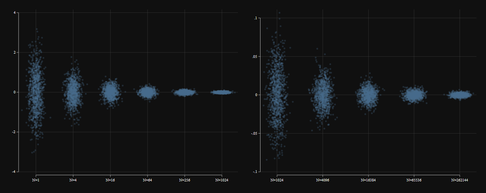

---

## What else changes?

- Perhaps the most important difference. When you have large enough samples, a combination of Law of Large numbers and the Central limit theorem, you no longer need normality assumption of the errors!

--
  - What is the Central Limit Theorem?
  
--  

- A different question...what is large enough? 
  
- It may depend, on the case:

---

## Simulations evidence:

.panelset[
.panel[.panel-name[Sample N=10]
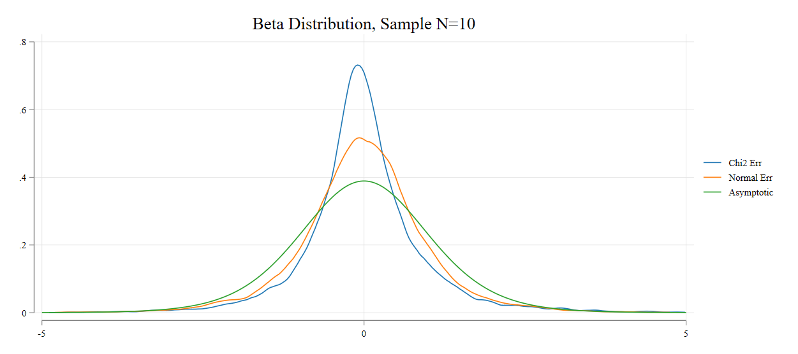
]
.panel[.panel-name[Sample N=30]
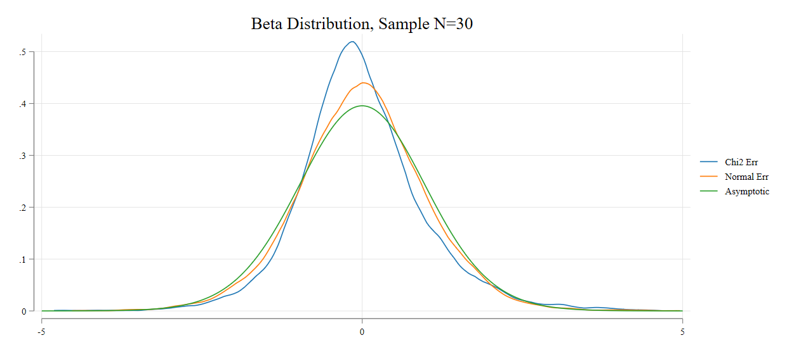
]
.panel[.panel-name[Sample N=100]
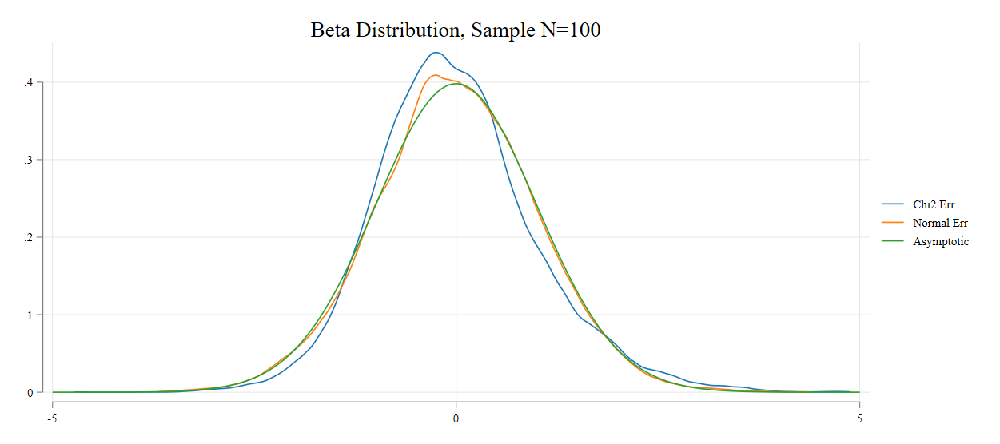
]
.panel[.panel-name[Sample N=500]
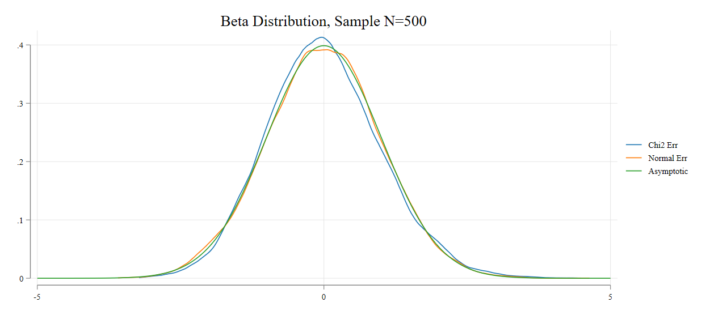
]
]


```{r xaringanExtra, echo=FALSE}

xaringanExtra::use_xaringan_extra(c("tile_view","editable","scribble",
                                    "panelset","tachyons",
                                    "clipboard","freezeframe",
                                    "extra_styles"))

#xaringanExtra::use_logo(  image_url =xaringanExtra::use_freezeframe() "https://raw.githubusercontent.com/rstudio/hex-stickers/master/PNG/xaringan.png")
#,"freezeframe","share_again"
```


```{r xaringan-themer, include=FALSE, warning=FALSE}
library(xaringanthemer)
style_mono_accent(base_color = "#3D4C53", 
 colors = c(
  red = "#f34213",
  purple = "#3e2f5b",
  orange = "#ff8811",
  green = "#136f63",
  white = "#FFFFFF"),
text_font_size = "1.1em"

 )

##code_font_google   = google_font("Fira Mono")

```

```{css echo=FALSE}
.title-slide {
  background-image: url(https://starwarsblog.starwars.com/wp-content/uploads/2020/04/star-wars-backgrounds-25.jpg);
  background-size: cover;
}
```
