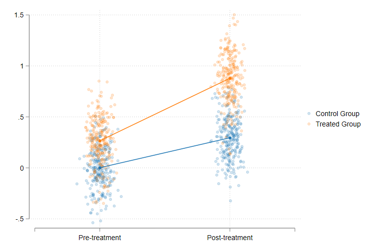
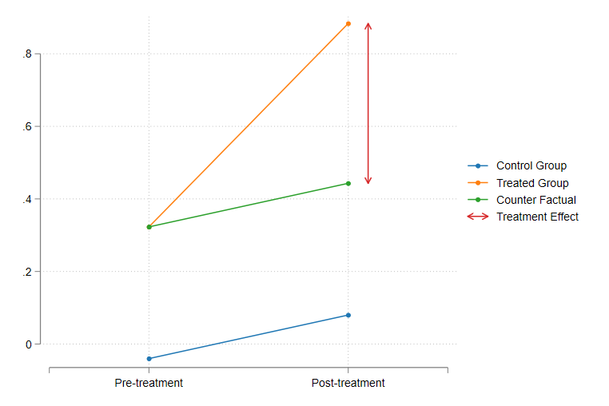
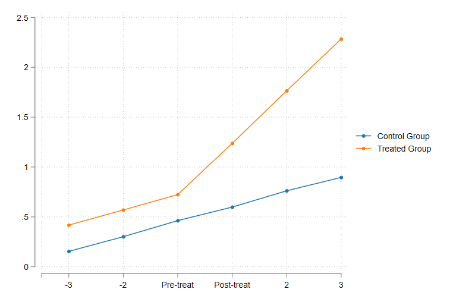
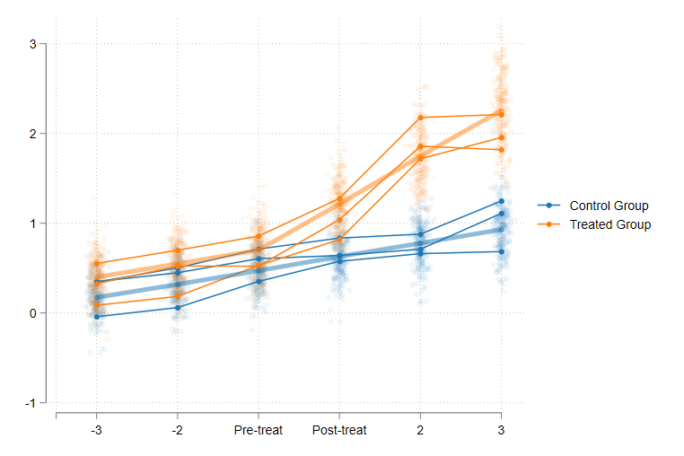

# DRDID and CSDID for Stata

## DRDID Version 1.6

Hello everyone, So version 1.6 is out!. Although to be frank, it has been out for a while. I just havent updated this page in a while, because I started to put more emphasis on the development of `csdid`. However, as I went along, a few changes have been incorporated in `drdid`, as I went along, and few bugs were reported here and there. 

You may notice that this "versioning" number is different from the version that is available to install using `net install`. The reason for that is the rythm at which I have been programming, and adding options to the program. Also, I just thought to use similar numbers between `drdid` and `csdid`. 

Similar to before, I will provide a quick help for the features currently available in the command, including the changes incorporated since my last update. In addition, I will try to do my best to explain the logic behind `drdid`, since this command is the core estimator procedure behind `csdid`.

The now command produces both panel and repeated crossection estimators proposed in Sant'Anna and Zhao (2020), plus one done using `teffects`: The Inverse Probability Weighting Augmented regression estimator-IPWRA (for panel data). While I have not included this on the helpfile yet (still need to fix some of its features), the command now allows you to use weights (which will be used as pweights), and can also produce the 1-step wild-bootstrap, providing the uniform Confidence intervals, as the R version does.  You can also use cluster SE, as long as the clusters are nested within the panel ID variable. 

You may also notice that the output from the `drdid` has changed slighly. EP (who wishes to remain anonymous) has helped providing a new display for the command, aligning better with `Stata` offical command style. He is also working on providing the option to obtain `DRDID` estimates via `gmm`. This approach is implemented for some of the panel estimators, and should provide a richer set of options to estimate and standard errors.

I have also added a better set of datachecks to make sure you have the data correctly setup. For instance, It will prompt you better error messages if you do not have a 2x2 DID structure. and will check if you do have a correct panel structure when you use the option `ivar`. Before it wouldnt do that, and would give you an incorrect results if you have, say, multiple observations per `ivar` and `time`. 

Finally, to protect data integrity, the influence functions are no longer "saved" or "stored" in the dataset, and neither is `__dy__`. They are not created as temporary variables, and will only save the IF when requested using the options `stub()` and/or `replace`.

Alright, I hope this guide helps in using this command, at least until is properly released through SSC. Please if you find any bugs or difficulties, do not hesitate to contact me at friosa@gmail.com.

Now, before I go into details with the command, let me do a quick review of what `DRDID` does, and why using it is better than the standard DID approach. This will carry a bit of theory, but hopefully not as much as the original paper does. If you are interested in the command itself, and its usage. you can skip the next section.

## DID, making the best of the 2x2 design

### **Prolog: The Problem**

In principle, you have access to data for two groups. Group 0 or control group, and group 1 or treated group. In addition, you observe the outcomes on this two groups across two periods (ideally the same periods), a T0 or pre-treatment when neither of the groups were treated, and T1 or post-treatment where the treated group gets treated. 

In the ideal scenario, you have access to panel data, and everybody who is observed at **T0** is also observed at **T1**. However, you can just as well apply DID when you only have access to repeated crossection data. If you were to plot this data, you may probably be have a figure like the following:



Given this design, how can you obtain an estimate of the treatment effect? One way I like using for understanding the estimation of TE in this setup is to write down the underlying Data generating function, along with the "What if?" Scenario. Now, lets say that rather than looking at the whole sample (or population), we concentrate on a single individiual, the *ith* individual. Here, I will depart a bit from what other people have written, to make it more explicit the role of heterogeneity.

So, lets say that at T0 the outcome for the *ith* individual is $u_i$. So, if he does not experience any treatment, his outcome at T1 will be $u_i+\tau_{i}$. I will use $y(0)$ to denote he was not treated. These are related as follows:

$$y(0)_{i0}=u_i \&  y(0)_{i1}=u_i+\tau_{i}$$

Where $y(0)_{i0}$ is random and unique to individual $i$, and $\tau_{i}$ is the a change that is also specific to this *ith* person, and assumed to be fixed across time. 

Next, we need to stablish the "what if?" scenario. Lets say that individual *ith* is treated at some point between T0 and T1, and thus, only his outcome at T1 will be affected:

$$y(1)_{i1}=y(0)_{i1}+\theta_i=u_i+\tau_{i}+\theta_i$$
$$y(1)_{i0}=y(0)_{i0}=u_i$$

Where $\theta_i$ represents the heterogeneous treatment effect, and $y(1)_{i1}$ represents the outcome at T1 if the individual is treated. This already imposes the assumption that the treatment did not affect his outcome **before** the treatment took place.

If we would be able to observe both the scenarios (under treatment as well as without any treatment), the estimation of the Treatement effect for the *ith* individual is straight forward. One would simply calculate the difference between the two counterfactuals. 

$$TE_i = y(1)_{i1} - y(0)_{i1} = \theta_i$$

This approach is, however, unfeasible, because one cannot observe both states of nature at the same time. 

### **The 2x2 design: 2 individuals and 2 periods**

Because we are unable to observe all possible scenarios, one of the most popular alternatives has been the use of Difference-in-difference approach. So lets return to the previous example.

Assume for a moment, that we have now two individuals. The treated at T1 (*ith*) and the untreated (*jth*).

One of the first approaches to identify the TE could be to simply observe at how much the outcome of an individual has increased before and after the treatment. If we look into individual *ith*, you can see that this would be incorrect:

$$D1:y(1)_{i1}-y(1)_{i0}=\tau_{i}+\theta_i$$

Looking at how the outcome has changed from one period to the other captures not only the effect we are after $\theta_i$, but also natural growth, we were expecting $\tau_{i}$. Only if you have strong assumptions of $\tau_{i}=0$ would this approach be appropriate.

A second alternative that is typically considered is to compare outcomes for the treated and untreated groups, and identify the effect as that difference:

$$D2:y(1)_{i1}-y(0)_{j1}=u_i+\tau_{i}+\theta_i- (u_j+\tau_{j}) $$
$$D2:y(1)_{i1}-y(0)_{j1}=(u_i-u_j)+(\tau_{i}-\tau_{j})+\theta_i $$

This approach is also incorrect. First of all, it requires the assumption that $\tau_{i}=\tau_{j}$. In other words, you need to assume that in absence of treatment, the *ith* individual would have followed the same *path* as *jth*. It also requires the assumption the potential outcomes of both individuals before treatment were the same ( $u_i=u_j$ ). This is a strong assumption considering that individuals are different. 

The 2x2 DID design suggests instead using a double difference. Capturing the benefits of the first and second approach:

$$ DD: [y(1)_{i1}-y(1)_{i0}]-[y(0)_{j1}-y(0)_{j0}] $$
or
$$ DD: [y(1)_{i1}-y(0)_{j1}]-[y(1)_{i0}-y(0)_{j0}] $$
Which gives:
$$ DD: TE_i=\theta_i+(\tau_{i}-\tau_{j})$$

Graphically, this can be thought as follows:



Now this approach allows you to estimate the ATT under relatively weaker assumptions. First, there is no need to assume no growth across time ($\tau_{j}=0$), or that individuals were practically identical before treatment ($u_i=u_j$). It is necessary, however, to impose the assumption that both individual do share the same "path" ($\tau_{i}=\tau_{j}$). Otherwise, our estimations of the TE will include the true treatment effect, but also the difference between their trends.

Unfortunately, this assumption is untestable if you only have data for one pre-treatment period. However, if more pre-treatment data is available, you can test for the "parallel lines" assumption using the same 2x2 design. Namely, if you use two pre-treatment periods, the Double difference should only capture the change in trends across groups (assuming no anticipation). And if that is the case, under the parallel lines assumption, DD should be equal to zero. 

Intuitively, If the parallel assumptions holds, you should see in the form of parallel lines for all periods before the treatment occured. 



### **The 2x2 design: Many individuals and 2 periods.**

If you have follow the literature on DID, you are probably aware that ***TWFE is not DID***, specially if you are dealing with multiple periods, with differential treatments. It is not that TWFE is wrong, but that the assumptions required to obtain ATT's were stronger that we were aware off. Now, of of the insights that motivated this trend of research was that Treatment effects should be considered heterogeneous across individuals, as well as across time, rather than constant for all individuals. 

You may also think, why not consider that "trends" are also heterogenous across all individuals. But if trends are heterogeneous, parallel trends will not hold!. On this regard, I think here is where the use of large samples helps. Thus the idea of **Many individuals and 2 periods**.

The idea is as follows. You now have many individuals, all of them have been followed across time, and some of them have been treated. In this scenario, one can still use the 2x2 DID design, with a few modifications. Namely, instead of using "individual" pre and post outcomes, we will use group averages. For notation, I will only use $g=1$ to indicate that the $ith$ observation is in the treated group, and $g=0$ if it is in the untreated group. 

$E(y(0)_{i,t}|g=0;t=0) = E(u_i                |g=0;t=0)=U_0$

$E(y(0)_{i,t}|g=0;t=1) = E(u_i+\tau_i         |g=0;t=1)=U_0+T_0$

$E(y(1)_{i,t}|g=1;t=0) = E(u_i                |g=1;t=0)=U_1$

$E(y(1)_{i,t}|g=1;t=1) = E(u_i+\tau_i+\theta_i|g=1;t=1)=U_1+T_1+ATT_1$

What I am doing with the equations above, is simply obtaining averages for the different elements that affect the outcome, for the treated and untreated groups, and for T0 and T1.

In this case, the DD could be written as:

$DD:  [E(.|g=1;t=1) - E(.|g=1;t=0)] - [E(.|g=0;t=1)-E(.|g=0;t=0)]$

$DD:  U_1+T_1+ATT_1 - U_1 - [U_0+T_0-U_0]$

$DD:  ATT_1+T_1- T_0$

So what its important to rescue from this last equation is that you do not necessarily need parallel trends for every single individual in the sample (which would be very hard to justify), but you need, at the very least, that the trends are in average parallel (ie $T_1= T_0$ or $E(\tau_i|g=1)=E(\tau_i|g=0)$. )

This is shown in the figure below. Looking at some specific cases, you may notice that the parallel trends assumption may not hold for each individual, even though in average (the thicker line) it does hold.



### **What about controls. Panel vs repeated cross section**

A better question may be, **why do we need controls?** or **what do we need to control for?**. One answer that I like is that we need controls to minimize the chances of other "uncontrol differences" to enter in the estimation of the ATT's. What are those differences?

The nature of those differences will depend on the type of data we are working with. 

As I showed you in the previous section, if you are using *panel data*, the basic DD estimator is equivalent to:

$$ATT_{pn} = ATT_1+T_1- T_0$$

and the difference that we want to "control" for comes from the parallel lines assumption difference $T_1- T_0$. Thus the use of controls is to help achieve the parallel lines asumption, by making this difference to be as close to 0 as possible. 

What about for Repeated Cross-section? 

For the case of Repeated Cross-section, the ATT estimator can be derived from the previous equations as well, but with a few modifications. First:

$E(y(0)_{i,t}|g=0;t=0) = E(u_i                |g=0;t=0)=U_{00}$

$E(y(0)_{i,t}|g=0;t=1) = E(u_i+\tau_i         |g=0;t=1)=U_{01}+T_{01}$

$E(y(1)_{i,t}|g=1;t=0) = E(u_i                |g=1;t=0)=U_{10}$

$E(y(1)_{i,t}|g=1;t=1) = E(u_i+\tau_i+\theta_i|g=1;t=1)=U_{11}+T_{11}+ATT_{11}$

The first subscript indicates the group, whereas the second subscript indicates the time. With this, the RC estimator will be:

$$ATT_{rc} = ATT_{11}+(U_{11}-U_{10})-(U_{01}-U_{00})+(T_{11}-T_{01})$$

So, we have now many more components to deal with!. First, we need to make sure that the parallel lines assumption holds $(T_{11}-T_{01})=0$, but we also need to make sure that the data used for the pre and post periods, and separate for the treated and untreated groups, are comparable. In other words we need $(U_{11}-U_{10})=0$ and $(U_{01}-U_{00})=0$.  

This is where Sant'Anna and Zhao (2020) come into play.

### **What to control for: Only the past, never the future** 

One of questions Pedro has been asked, and I wonder myself, when thinking about covariates, is how to use them for adjusting for the differences described above. His answer, always use pre-treatment covariates!. The question is **why?**.

I think a good answer is to ask instead, what are you trying to control with varying covariates?. 

Consider the following cases:

1. Covariates increase at random for all individuals. In this case it is not necessary to control for those changes because if every body will experience them, their impact on the will cancel out. And if the changes happen at random, we do not need to control for them, because they will also average out. 
2. Covariates increase more for the treated group (compared to the untreated), because of the treatment. This is an example of bad controls. We would be trying to use controls that are affected by the treatment itself. The effect of the treatment would now be "absorbed" by the bad control.
3. Covariates increase more for the treated group (compared to the untreated), but exogenously. In this case, it might be valid to control for varying covariates. 
   
   In this case, you could control not only for pre-treatment characteristics, but also for the expected changes on those characteristics. However, for this setup to work, you need to impose the strict exogeneity assumption. In other word, you need to argue that the observed change was not affected by the treatment, nor by the outcome. 
  
Now, if you are working with repeated crossection, things change. Unless you have access to "pre-treatment" covariates for the Post period sub- samples, you won't be able to control for pretreatment characteristics as in panel data case. This means that you have to relax the assumption, and let all characteristics be different across groups and time, even though we mantain the assumption that either covariates do not change across time, or if changes occur, those are strictly exogenous. 

### **Two shots for the same problem: Doubly Robust estimators**

From my explanation in the previous section it should be clear that the role of Controls in the DID is to improve the chances that parallel lines assumptions holds, as well as that the groups we use for the pre- and post- period are comparable, (when we use repeated crossection data). But I should also clarify that the general recomendation is to include only "pre-treatment" controls, unless you have a strong argument that post treatment characteristics are strictly exogenous. 

Now more on the specific question. How do you use controls to improve on the DID estimation? 

There are three solutions: Regression approach, reweighting approach, or a combination of both! How do they work?. For this, I'll do it for the Panel estimator, but you can also use a similar strategy for the repeated crossection estimators.

**Regression**

Lets reconsider an alternative expression for the Panel:

$$ATT_{pn} =[E(.|g=1;t=1) - E(.|g=1;t=0)] - [E(.|g=0;t=1)-E(.|g=0;t=0)]$$
$$ATT_{pn} =[E(y_{i,1}-y_{i,0}|g=1)] - [E(y_{i,1}-y_{i,0}|g=0))]$$
$$ATT_{pn} = E(\Delta y(1)) - E(\Delta y(0)) $$

If I would like to estimate the TE with respect to the treated group (the ATT), I could run a regression for $\Delta y_i$ for the untreated group only:

$$\Delta y(0)=X_0\beta + e_{i}$$

use those Betas to make a prediction for $\Delta y(0)$ for the treated:

$$\Delta \hat{y}(1) =X_1\hat{\beta}$$

and use that prediction to substitute on the ATT:

$$ATT_{pn} = E(\Delta y(1)) - X_1\hat{\beta}) $$

**Reweighting approach**

The other option is do Reweighting. The idea behind this procedure is to adjust the distribution of covariates between the treated and untreated group, so they look more similar to each other.

The first step is estimating a logit model with the treatment status as dependent variable:

$$P(tr=1|X)=\Lambda(X\beta)$$

Calculate the IPW, to be applied to the control group (the IPW for the treated group =1):

$$IPW=\Lambda(X\beta)/(1-\Lambda(X\beta))$$

And then simply estimate the ATT's, using this weights:

$$ATT_{pn} = E(\Delta y(1)) - E(\Delta y(0);IPW) $$

**Doubly Robust**

The Doubly Robust estimator is a combination of these two approaches. One would use the Outcome regression approach to account to model the outcome, and the logit regression to model the probability of an observation being treated or not.  You have better chances to get a good estimation for the ATT, since you just need one of the models to be correctly specified.

$$ATT_{pn} = E(\Delta y(1)  - X_1\hat{\beta}|tr=1) - E(\Delta y(0)-X_0\hat{\beta}|tr=0;IPW) $$

If the outcome model is well specified, then $E(\Delta y(0)-X_0\hat{\beta}|tr=0;IPW)=0$  and the treatment effect is driven by the first component.

If the IPW is well specified, $E(X_1\hat{\beta}|tr=1)=E(X_0\hat{\beta}|tr=0;IPW)$ and the ATT is driven by the IPW component. 

And this is pretty much it. This is the workhorse behind CSDID, and this notes will hopefully help understand what `drdid` does, and why.
So lets go back to the model and implementation

## **Setup**

For the replication exercise, I'll use the same dataset used in the example for the `drdid` command in R. Let's call it lalonde.dta. 

```
use https://friosavila.github.io/playingwithstata/drdid/lalonde.dta, clear
```

Then, you may need to make sure to copy the files [drdid.ado](https://friosavila.github.io/playingwithstata/drdid/drdid.ado) in your personal ado folder. For my pc, it's in `C:\ado\personal`. 

## drdid in action

I tried to keep the syntax of drdid relatively standard. At least standard with other commands I have worked before. So some of the options may change slightly, as other features are integrated.

The general syntax of the command is as follows

``` 
drdid depvar [indepvar] [if] [in] [iw], [ivar(varname)] time(varname) tr(varname) [estimator] [wboot rseed(#) ///
cluster(varname) gmm stub(str) replace]
```

Here an explanation of all the pieces:

- **`depvar`** : is your dependent variable or outcome of interest
- **`indepvar`**: are your independent variables, you may or may not have variables here. These variables will included in the outcome regression specification and the propensity score estimation.
- **`ivar`**: is a variable that identifies the panel ID. If you drop this, the command will use repeated crossection estimators instead. If included, it will estimate the panel estimators, after checking you indeed have a panel setup.
- **`time`**: identifies the time variable (for example year). It does not matter if the periods are contiguous or not. However, its important that you have only 2 values in `time` for the working sample. The earlier period will be used as `pre`, whereas the later period will be used as `post`.
- **`tr`**: is the treatment variable. It does not matter what values you use, as long as there are only two values in the used sample. Observations with lower values are the `control group`, whereas observations with the higher values are the `treated groups`.
- **`estimator`** is used to indicate which estimator you want to use. Below the list of all that is available:
  - **`drimp`** Estimates the DR improved estimator. If you add `rc1` it provides you with the alternative estimator (that is not locally efficient)
  - **`dripw`** Estimates the DR IPW estimator. You can also use `rc1` to provide the alternative (not locally efficient) estimator.
  - **`reg`** Estimates the Outcome regression estimator. 
  - **`stdipw`** Estimates the Standard IPW estimator.
  - **`ipw`** Estimates the estimator similar to Abadies (2005)
  - **`ipwra`** Estimates the IPW regression augmented estimator. This is estimated through `Stata` command `teffects ipwra`. Not available for Repeated Crossection
  - **`all`** Provides all estimators. Perhaps you may find it useful for robustness. (I did it for replication). This results cannot be used to make comparison across estimators. 
- **`wboot`**: When used, the command will estimate the 1-step wild-bootstrap (or multiplier bootstrap), with 999 repetions. It currently implements Mammen(1993) approach. This does not work after **`all`** or after **`ipwra'**. 
- **`cluster`**: When used, the command will estimate the clustered standard errors based. It can be used in combination with **`wboot`**.
- **`gmm`**: When used, requests the estimation of SE using *`gmm`*. You can combine this with other `gmm` SE estimators. See `help gmm` for other details. This estimator is available only for panel estimators. 
- **`rseed(#)`**: Used for replication purposes. Sets the Seed for random numbers.
- **`stub`**: When used, the *recentered influence function* will be stored in the dataset with the name **`stub`**_`att`_. If the variable already exists, you can request to overwrite it using `replace`. This option does not work when one requests **all** estimators, or when **`ipwra`** estimator is requested. 


So, how does this work? Lets start with the lanlonde dataset, and the Panel estimators. For a quick application, I ll use the `all` option:

```
drdid re age educ black married nodegree hisp re74 if treated==0 | sample==2 , ivar(id) time(year) tr( experimental )  all 
```

and if everything went well, you should be seeing this:

```
Doubly robust difference-in-differences estimator summary
------------------------------------------------------------------------------
             | Coefficient  Std. err.      z    P>|z|     [95% conf. interval]
-------------+----------------------------------------------------------------
ATET         |
       dripw |  -871.3271   396.0211    -2.20   0.028    -1647.514   -95.14007
       drimp |  -901.2703   393.6127    -2.29   0.022    -1672.737   -129.8037
         reg |  -1300.645   349.8259    -3.72   0.000    -1986.291   -614.9985
         ipw |  -1107.872   408.6127    -2.71   0.007    -1908.738   -307.0058
      stdipw |  -1021.609   397.5201    -2.57   0.010    -1800.734   -242.4845
      sipwra |  -908.2912   393.8673    -2.31   0.021    -1680.257   -136.3255
------------------------------------------------------------------------------
Note: This table is provided for comparison across estimations only. You cannot use them to compare across estimates across different estimators
dripw :Doubly Robust IPW
drimp :Doubly Robust Improved estimator
reg   :Outcome regression or Regression augmented estimator
ipw   :Abadie(2005) IPW estimator
stdipw:Standardized IPW estimator
sipwra:IPW and Regression adjustment estimator.
```
 
We could also estimatethe repeated crossection estimators to this data, by simply excluding `ivar()` option. This could also be applied, for example, if you have access to unbalanced panel data. This is how `DRDID` in R deals with unbalance panel.

Perhaps the main problem with this option is that the estimations will be less efficient, with larger standard errors. The loss of efficiency is caused because we are now ignoring an important piece of information: the panel id.

```
. drdid re age educ black married nodegree hisp re74 if treated==0 | sample==2 ,  time(year) tr( experimental )  all 

Doubly robust difference-in-differences estimator summary
------------------------------------------------------------------------------
             | Coefficient  Std. err.      z    P>|z|     [95% conf. interval]
-------------+----------------------------------------------------------------
ATET         |
       dripw |  -871.3271   410.2751    -2.12   0.034    -1675.452   -67.20268
   dripw_rc1 |  -871.3271   435.0661    -2.00   0.045    -1724.041   -18.61332
       drimp |  -901.2703   408.3107    -2.21   0.027    -1701.545    -100.996
   drimp_rc1 |  -901.2703   434.3043    -2.08   0.038    -1752.491   -50.04954
         reg |  -1300.645   418.5023    -3.11   0.002    -2120.894   -480.3951
         ipw |  -1107.872   619.4393    -1.79   0.074    -2321.951    106.2068
      stdipw |  -1021.609    495.464    -2.06   0.039    -1992.701   -50.51783
------------------------------------------------------------------------------
Note: This table is provided for comparison across estimations only. You cannot use it to compare estimates across different estimators
dripw :Doubly Robust IPW
drimp :Doubly Robust Improved estimator
reg   :Outcome regression or Regression augmented estimator
ipw   :Abadie(2005) IPW estimator
stdipw:Standardized IPW estimator
sipwra:IPW and Regression adjustment estimator.
```

It is possible, however, to apply clustered standard errors using the panel id. This is useful if you have unbalanced data, and want to keep all observations in the sample. In this case, it will be the equivalent to using `ivar`, because the data is fully balanced.

```
. drdid re age educ black married nodegree hisp re74 if treated==0 | sample==2 ,  time(year) tr( experimental )  all  cluster(id)

Doubly robust difference-in-differences estimator summary
------------------------------------------------------------------------------
             | Coefficient  Std. err.      z    P>|z|     [95% conf. interval]
-------------+----------------------------------------------------------------
ATET         |
       dripw |  -871.3271   396.1635    -2.20   0.028    -1647.793   -94.86092
   dripw_rc1 |  -871.3271   396.1635    -2.20   0.028    -1647.793   -94.86092
       drimp |  -901.2703   393.6127    -2.29   0.022    -1672.737   -129.8037
   drimp_rc1 |  -901.2703   393.6127    -2.29   0.022    -1672.737   -129.8037
         reg |  -1300.645   349.8259    -3.72   0.000    -1986.291   -614.9985
         ipw |  -1107.872   408.6127    -2.71   0.007    -1908.738   -307.0058
      stdipw |  -1021.609   397.5201    -2.57   0.010    -1800.734   -242.4845
------------------------------------------------------------------------------
Note: This table is provided for comparison across estimations only. You cannot use it to compare estimates across different estimators
dripw :Doubly Robust IPW
drimp :Doubly Robust Improved estimator
reg   :Outcome regression or Regression augmented estimator
ipw   :Abadie(2005) IPW estimator
stdipw:Standardized IPW estimator
sipwra:IPW and Regression adjustment estimator.
```

We can also do the same using the simulated dataset provided also in R's `DRDID`. This to show how it estimates the model assuming repeated crossection.

```
use https://friosavila.github.io/playingwithstata/drdid/sim_rc.dta, clear
```

And let me use the same syntax as before, to obtain all estimates at the same time. Notice that I'm not including the "ivar" indicator. So the command uses the repeated crossection estimators:

```
. drdid y x1 x2 x3 x4, time(post) tr( d)   all

Doubly robust difference-in-differences estimator summary
------------------------------------------------------------------------------
             | Coefficient  Std. err.      z    P>|z|     [95% conf. interval]
-------------+----------------------------------------------------------------
ATET         |
       dripw |  -.1677954   .2007987    -0.84   0.403    -.5613537    .2257628
   dripw_rc1 |  -3.633433   3.105569    -1.17   0.242    -9.720237     2.45337
       drimp |  -.2097772   .1978384    -1.06   0.289    -.5975333    .1779789
   drimp_rc1 |  -3.683518   3.112235    -1.18   0.237    -9.783387    2.416351
         reg |  -8.790978   7.774585    -1.13   0.258    -24.02888    6.446929
         ipw |   -19.8933   53.84128    -0.37   0.712    -125.4203    85.63367
      stdipw |  -15.80331   9.083384    -1.74   0.082    -33.60641      1.9998
------------------------------------------------------------------------------
Note: This table is provided for comparison across estimations only. You cannot use it to compare estimates across different estimators
dripw :Doubly Robust IPW
drimp :Doubly Robust Improved estimator
reg   :Outcome regression or Regression augmented estimator
ipw   :Abadie(2005) IPW estimator
stdipw:Standardized IPW estimator
sipwra:IPW and Regression adjustment estimator.

```

What about Wild bootstrap? You can request WB SE but if you do that, you need to request specific estimator. I will use the option `rseed(1)`, in case you want to replicate the results.

 Below an example for dripw:

```

. drdid y x1 x2 x3 x4, time(post) tr( d)  dripw

Doubly robust difference-in-differences                  Number of obs = 1,000
Outcome model  : least squares
Treatment model: inverse probability
------------------------------------------------------------------------------
             | Coefficient  Std. err.      z    P>|z|     [95% conf. interval]
-------------+----------------------------------------------------------------
ATET         |
           d |
   (1 vs 0)  |  -.1677954   .2007987    -0.84   0.403    -.5613537    .2257628
------------------------------------------------------------------------------

. drdid y x1 x2 x3 x4, time(post) tr( d)  dripw wboot rseed(1)

Doubly robust difference-in-differences                  Number of obs = 1,000
Outcome model  : least squares
Treatment model: inverse probability

----------------------------------------------------------------------
             | Coefficient  Std. err.      t      [95% conf. interval]
-------------+--------------------------------------------------------
ATET         |
           d |
    (1 vs 0) |  -.1677954    .202006    -0.83    -.5655866    .2299957
----------------------------------------------------------------------

```

Notice that when Wildbootstrap SE are requested, you no longer get the p-value. And that the CI are based on the symetric WB distribution. 

And that is it!. Please, if you find any bugs or encounter any problems. Let me know. So, what is next?

# CSDID Version 1.6

`CSDID` 1.6 is here!. You can see the details on this on the left. And if you already read it, you should be in fair shape to understand what the estimator does, and why it works. 

## what is next for `DRDID`?

1. `drdid` is done. As always stress testing is needed, but most of the bugs that have been reported related to problems with `csdid` and not with `drdid`. So I think we are in good shape with this command. Perhaps need to go into the code and get some efficiency improvements. Specially when working with `csdid`
2. Along with E.P., we have added `gmm` estimators to `drdid`. It will just be to provide you with more options for analysis and report. Currently it allows for most panel estimators. He also provided a new Display function.
 
If you have comments or questions, please, let me know!

