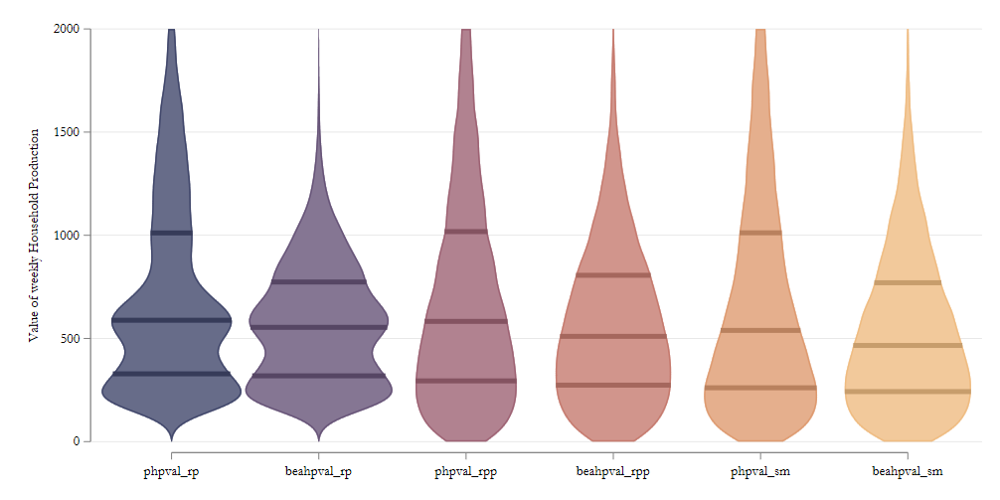

class: center, middle, inverse

## Valuation of HP: 
## the How

---

## Valuation of HP: Summary

During the last meeting we described, in general terms, our procedure for valuing Household production.

.pull-left[
**Preferred**: Use of Specialized wage, to differentiate across different types of activities ]
.pull-right[

**Alternative**: Use of generalist wage, assuming an homogeneous "product" ]

--

- In addition, **preferred** and **alternative** methodology construct aggregate household production differently, with the **alternative** method considering only active household production activities provided by household members.

---

## HP types and aggregation

In our efforts to construct an internally consistent measure of consumed household production into the following categories:

.pull-left[
- Cooking and related activities
- Other housework (except cooking) and shopping
- Active Child care
- Adult Care
  ]
.pull-right[
- "External" Child Care help (potential)
- "External" Adult Care help (potential)
- Supervisory Care Overlapping with Other HP
- Supervisory Care non Overlapping with Other HP
]

--

- All components are adjusted to obtain weekly hours (x5weekday-x2weekend or x7 days)

- And aggregated at the household level (Scaling down Sup-care)

- All imputation methods (**RP, RP+ and SM**) use similar structure except for Sup-Care overlapping

  - For SM, we use .red[*imputed/transferred*] values from ATUS
  - For RP and RP+ we use conditional means

---

##	Imputation Method	and Wages

|Time component |	Statistical Matching |	Regression (RP & RP+) |	Comment|	Surveys| Wages |
|--|--|--|--|--|
|Cooking|	x|	x	|Double Match|	ATUS| Cooks |
|Other HPA|	x| 	x| 	Double Match|	ATUS | Generalist|
|Child Care|	x	|x|	Double Match| ATUS | KE Teachers|
|Adult Care|	x |	x|	Double Match|	ATUS| Nursing Assistants|
|External CCare| |  |logit/avg| ATUS-SIPP | KE Teachers|
|External ACare| | |logit/poisson| ATUS;HRS| Nursing Assistants|
|Non-over Sup-Care|	x |	x |	Double Match |	ATUS|KE Teachers/2|
|Over Sup-Care|	x	|	| E(cond  X) |	ATUS|KE Teachers/2|

---

## Final Valuation:

Simple accounting:

$$HPC_i = \sum  w_j * ht_{ij}$$
$\forall \ j=$ Cooking, Other HW, child care, Adult Care, External Child Care, External Adult Care, and Supervisory Child Care.

- For preferred method, $w_j$ is different for each activity.

- For BEA method, $w_j=w_{generalist}$ for all but External Care and Supervisory care. These activities receive a wage of zero $w_j=0$.

---

class: center, middle, inverse

# Results

---

# Wages by Activity

|Division	|Cooking|	Other HW |	Adult care |	Act Ccare|	Sup. Ccare|
|--|--|--|--|--|--| 
|New England 	|15.6|	14.0|	16.3|	19.0|	9.5|
|Middle Atlantic |	14.4|	13.9|	16.5|	19.1	|9.6|
|East North Central| 	12.7|	13.4|	14.3|	15.0|	7.5|
|West North Central |	12.9|	12.9|	14.4|	16.4|	8.2|
|South Atlantic| 	12.7|	13.4|	13.6|	15.2|	7.6|
|East South Central |	11.0|	13.4|	12.5|	14.9|	7.4|
|West South Central |	11.6|	12.3|	12.8	|17.0|	8.5|
|Mountain |	13.4|	12.8|	15.3|	15.6|	7.8|
|Pacific |	15.0|	13.5|	17.3|	17.8|	8.9|

> Right now we are using "imputed" Division in the CE. Is there a fully observed division value in the internal data?

> Generalist wages will only be available at Division level.
---

## Avg. value of Weekly Household Time Consumption


|	|Pr-RP |Pr-RP+	|Pr-SM	|BEA-RP	|BEA-RP+		|BEA-SM|
|-|-|-|-|-|-|
|CE interview|	722|	723	|709|	577|	577|	551|
|CE diary	|717|	716|	702|	575|	576|	548|

This represents between 34% to 45% of average household income.

--

Across the distribution (Interview Sample):

|	|Pr-RP |Pr-RP+	|Pr-SM	|BEAa-RP	|BEA-RP+		|BEA-SM|
|-|-|-|-|-|-|
| Mean|	722|	723|	709|	577|	577|	551|
|SD|	494|	565|	601|	305|	395|	417|
|p10|	213	|132|	118|	213|	127|	110|
|p50|	588	|583|	539	|554|	510|	466|
|p90|	1456|	1518	|1542|	982|	1105|	1090|
|p50/p10|	2.756	|4.399|	4.579|	2.604	|4.018|	4.252|
|p90/p50|	2.475|	2.605|	2.861|	1.774|	2.165|	2.340|
|Gini|	0.368	|0.420	|0.444	|0.293|	0.375|	0.400|
 	 	 	 	 	 	 
---

## Distribution of Value HP



---

## How much time is Imputed?

Hours per week

|	|Preferred	|BEA|	Cooking	|Other HW |	C. Care	| A. Care | 	Ext CCare |  Ext ACare| Sup.Care no-over |	Sup. care over|
|--|--|--|--|--|--|--|--|--|--|--|
|RP|	56.4	|43.3|	9.0|	27.0|	6.2|	1.0	|1.2	|0.5	|8.0	|3.4|
|RP+|	56.4	|43.4|	9.1|	27.0|	6.2|	1.0	|1.2	|0.5	|8.0|	3.4|
|SM|	56.0	|41.3|	8.5|	25.6|	6.3|	0.9	|1.2	|0.5	|8.9|	4.0|
	
Value per week

|	|Preferred	|BEA|	Cooking	|Other HW |	C. Care	| A. Care | 	Ext CCare |  Ext ACare| Sup.Care no-over |	Sup. care over|
|--|--|--|--|--|--|--|--|--|--|--|
|RP|	719.5|	576.2	|119.7|	359.7|	102.9	|15.6|	20.0|	7.8|	66.2|	27.7|
|RP+|	719.6|	576.5	|120.1|	359.6	|103.3	|15.3	|20.0|	7.8|	65.9|	27.7|
|SM	|705.2|	549.2	|113.2	|340.5	|103.8	|13.3	|20.0|	7.8|	73.5|	33.1|

---

## What explains the inequality?

Gini Decomposition

|	|BEA|	Pref Hrs	|Pref Wages	| Pref| D Hrs| D wages|
|-|-|-|-|-|-|-|
|RP|	0.293	|0.383	|0.307	|0.368|0.090|0.014|
|RP+	|0.375|	0.430	|0.386	|0.420|0.055|0.011|
|SM	|0.400	|0.457	|0.409	|0.444|0.057|0.010|

---

## What explains the inequality?

.panelset[
.panel[.panel-name[SM]

| SM                        | Share | Gini  | Contribution |
|---------------------------|-------|-------|--------------|
| Cooking                   | 0.160 | 0.480 | 0.114        |
| Other House work          | 0.480 | 0.426 | 0.334        |
| Child Care                | 0.149 | 0.828 | 0.246        |
| Adult Care                | 0.019 | 0.921 | 0.017        |
| External Child Care       | 0.029 | 0.877 | 0.041        |
| External Adult Care       | 0.011 | 0.983 | 0.010        |
| Sup. care not overlapping | 0.104 | 0.796 | 0.158        |
| Sup. care overlapping     | 0.047 | 0.831 | 0.079        |

]

.panel[.panel-name[RP]

| RP                        | Share | Gini  | Contribution |
|---------------------------|-------|-------|--------------|
| Cooking                   | 0.165 | 0.305 | 0.116        |
| Other House work          | 0.499 | 0.257 | 0.235        |
| Child Care                | 0.144 | 0.794 | 0.295        |
| Adult Care                | 0.021 | 0.599 | 0.020        |
| External Child Care       | 0.028 | 0.877 | 0.058        |
| External Adult Care       | 0.011 | 0.983 | 0.012        |
| Sup. care nonoverlapping  | 0.092 | 0.803 | 0.189        |
| Sup. care overlapping     | 0.039 | 0.770 | 0.075        |

]
.panel[.panel-name[RP+]

| RP+                        | Share | Gini  | Contribution |
|---------------------------|-------|-------|--------------|
| Cooking                   | 0.165 | 0.493 | 0.122        |
| Other House work          | 0.497 | 0.391 | 0.319        |
| Child Care                | 0.145 | 0.834 | 0.262        |
| Adult Care                | 0.021 | 0.910 | 0.023        |
| External Child Care       | 0.028 | 0.877 | 0.047        |
| External Adult Care       | 0.011 | 0.983 | 0.010        |
| Sup. care not overlapping | 0.093 | 0.833 | 0.159        |
| Sup. care overlapping     | 0.039 | 0.770 | 0.059        |

]


]

---

class: middle

## Conclusions

We have now finished with the imputation and valuation of HP. 

Next step is putting it all together with CE expenditure data to analyze if there are any interesting patterns in expenditure 

---
class: middle, center

# Thank you

```{r xaringan-scribble, echo=FALSE}
xaringanExtra::use_scribble()
```

```{r xaringanExtra, echo=FALSE}
xaringanExtra::use_xaringan_extra(c("tile_view",
                                    "share_again",
                                    "panelset","tachyons",
                                    "clipboard"))
```

```{css echo=FALSE}
code.stata{
  font-size: 15px;
}
```

```{r xaringan-extra-styles, echo=FALSE}
xaringanExtra::use_extra_styles(
  hover_code_line = TRUE,         #<<
  mute_unhighlighted_code = FALSE  #<<
)
```

```{r xaringan-themer, include=TRUE, warning=FALSE , echo=FALSE}
library(xaringanthemer)

style_duo_accent(primary_color = "#3a5a40", secondary_color = "#dad7cd" ,
                 header_font_google = google_font("Josefin Slab", "600"),
                 text_font_google   = google_font("Work Sans", "300", "300i"),
                 title_slide_text_color = "#dad7cd" )
```

```{r , echo=FALSE}
xaringanExtra::use_webcam()
```